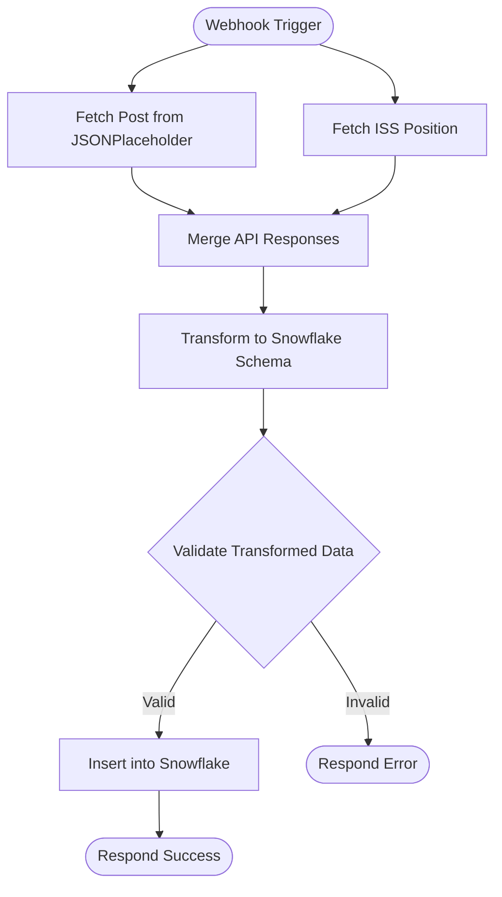

# context.md — API - Fetch Transform - Snowflake

## Purpose
Eliminates manual data gathering from multiple REST APIs and reduces the error-prone process of hand-transforming and uploading JSON payloads to Snowflake for Revenue Ops reporting.

## What It Does
1. A webhook receives a POST request to trigger the pipeline
2. Two REST API calls are made in parallel — one to JSONPlaceholder to fetch a post record, and one to the Open Notify API to fetch the current ISS position
3. Both API responses are merged into a single record by position
4. A transform step extracts and renames the required fields: `post_id`, `post_title`, `iss_latitude`, `iss_longitude`, and `loaded_at` (ISO timestamp)
5. A validation check confirms `post_id` is present and non-empty before proceeding
6. On success, the transformed record is inserted into the `SAMPLE_DB.PUBLIC.API_RESULTS` table in Snowflake and the webhook responds with a JSON success message
7. On failure, no data is written and the webhook responds with a 422 error message

## Workflow Diagram

> Diagram auto-generated from workflow node graph at submission time.

## Tools & Connectors Used
| Tool / Service | How It's Used |
|---|---|
| JSONPlaceholder API | Fetches a sample post record (id, title, body) via HTTP GET — used as the primary data source |
| Open Notify ISS API | Fetches the current ISS latitude and longitude via HTTP GET — used as the secondary data source |
| Snowflake | Receives the merged and transformed record via an INSERT into `SAMPLE_DB.PUBLIC.API_RESULTS` |

## Credentials Required
| Credential Name | Service | Notes |
|---|---|---|
| Snowflake Account | Snowflake | Personal credentials — must be configured in the automation before running |

> ⚠️ Never include credential values — names only.

## KPI Baseline
| Metric | Value |
|---|---|
| Manual time per run (before) | 10 minutes |
| Estimated runs per week | 35 |
| Projected hours saved/week | 5.83 hours |

## Risk Self-Assessment
| Risk Type | Present? | Notes |
|---|---|---|
| Handles PII / personal data | No | Only fetches public sample data from JSONPlaceholder and ISS position |
| Makes external API calls | Yes | Calls JSONPlaceholder (public) and Open Notify ISS API (public) on every run |
| Involves financial data | No | No financial data is processed |
| Requires human decision point | No | Fully automated — validation and error handling are built in |
| Shared automation modification risk | No | Uses personal credentials; cloned from demo-fetch-public-data-transform |

## Submitter
**Name:** Vishal Mishra
**Email:** vishalm.mishra@fulcrumapp.com
**Date:** 2026-06-09
**n8n Workflow ID:** YSiKyCBLOva12QMB
**Registry ID:** 6348e11c-1e3e-4d3a-a30c-8087dce86d45
**COE Portal:** https://coe-portal.devsavant.com/catalog/6348e11c-1e3e-4d3a-a30c-8087dce86d45
**Instance:** shivamheaptrace.app.n8n.cloud
**Source:** Cloned from demo-fetch-public-data-transform