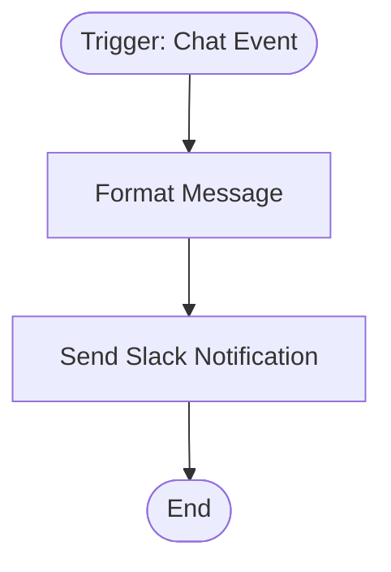

# context.md — Chat - Trigger Message - Slack

## Purpose
Demonstrates an end-to-end chat-event automation: when a message is submitted via n8n's hosted chat interface, the workflow captures it, formats it, and posts a notification to a Slack channel — enabling teams to monitor chat activity in real time.

## What It Does
1. **Chat Event Trigger** — Listens on the n8n hosted chat widget. Fires each time a user submits a message, exposing `chatInput` and `sessionId` as output fields.
2. **Format Message** — Uses a Set node to build a Slack-ready markdown string combining the chat message text and an ISO timestamp.
3. **Send Slack Notification** — Posts the formatted message to the `#general` Slack channel using the Slack OAuth2 API with markdown enabled.

## Workflow Diagram

> Diagram auto-generated from workflow node graph at submission time.
> Each box represents an n8n node in execution order.
> Rounded boxes mark the trigger and terminal nodes.

## Tools & Connectors Used
| Tool / Service | How It's Used |
|---|---|
| n8n Chat Trigger | Captures the inbound chat message and session ID |
| n8n Set Node | Formats the chat input into a Slack markdown message with timestamp |
| Slack (OAuth2) | Posts the formatted notification to the `#general` channel |

## Credentials Required
| Credential Name | Service | Notes |
|---|---|---|
| Slack OAuth2 | Slack | Must have `chat:write` and `chat:write.public` scopes |
> ⚠️ Never include credential values — names only.

## KPI Baseline
| Metric | Value |
|---|---|
| Manual time per run (before) | ~2 minutes (manual copy-paste to Slack) |
| Estimated runs per month | ~200 |
| Projected hours saved/month | ~6.5 hours |

## Risk Self-Assessment
| Risk Type | Present? | Notes |
|---|---|---|
| Handles PII / personal data | Possible | Chat input may contain user-provided PII; no data is stored |
| Makes external API calls | Yes | Slack API via OAuth2 |
| Involves financial data | No | — |
| Requires human decision point | No | Fully automated |

## Submitter
**Name:** Vishal Mishra  
**Date:** 2026-05-21  
**n8n Workflow ID:** wkYwBad2CYSzXrxY  
**Instance:** vishalmishra.app.n8n.cloud
