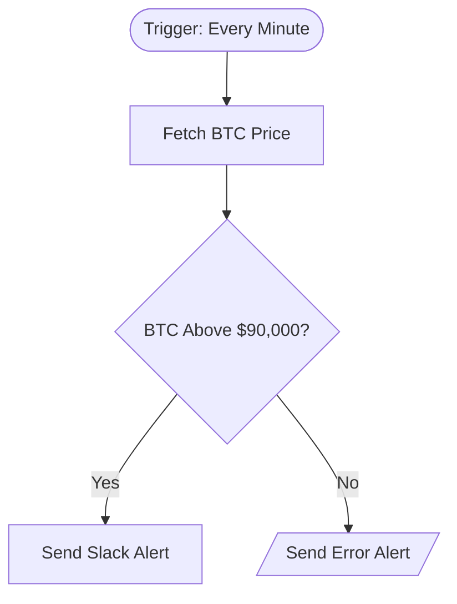

# context.md — Crypto - Price Alert - Slack

## Purpose
This automation monitors Bitcoin prices in real time and immediately alerts the Engineering team on Slack when BTC crosses a set threshold — removing the need for anyone to manually check prices throughout the day.

## What It Does
1. Triggers automatically every minute via a schedule
2. Fetches the current Bitcoin price in USD from the CoinGecko public API (no authentication required)
3. Checks whether the price is above $90,000
4. If the threshold is crossed: sends a formatted Slack alert to #general with the current price and timestamp
5. If the price fetch fails: sends an error notification to #general so the team knows the monitor is down

## Workflow Diagram

> Diagram auto-generated from workflow node graph at submission time.

## Tools & Connectors Used
| Tool / Service | How It's Used |
|---|---|
| CoinGecko API | Public REST API polled every minute to retrieve the current Bitcoin USD price — no API key required |
| Slack | Receives formatted alert messages in #general when BTC exceeds $90,000, and error notifications if the price fetch fails |

## Credentials Required
| Credential Name | Service | Notes |
|---|---|---|
| Slack OAuth2 | Slack | Used to post messages to #general; requires chat:write scope |

> ⚠️ Never include credential values — names only.

## KPI Baseline
| Metric | Value |
|---|---|
| Manual time per run (before) | 4 minutes |
| Estimated runs per week | 35 |
| Projected hours saved/week | 2.33 hours |

## Risk Self-Assessment
| Risk Type | Present? | Notes |
|---|---|---|
| Handles PII / personal data | No | Only public market price data is processed |
| Makes external API calls | Yes | Calls CoinGecko public API every minute; subject to rate limits (~30 req/min on free tier) |
| Involves financial data | Yes | Monitors Bitcoin price — informational only, does not execute any trades or transactions |
| Requires human decision point | No | Fully automated; alert is informational and requires no human action to trigger |
| Shared automation modification risk | No | Original build — not cloned or modified from an existing shared automation |

## Submitter
**Name:** Vishal Mishra
**Email:** vishalm.mishra@fulcrumapp.com
**Date:** 2026-06-11
**n8n Workflow ID:** hJxhiC8fV4mOIero
**Registry ID:** 154a6241-5baf-4ee8-8651-3b6b493b89eb
**COE Portal:** https://coe-portal.devsavant.com/catalog/154a6241-5baf-4ee8-8651-3b6b493b89eb
**Instance:** shivamheaptrace.app.n8n.cloud
**Source:** Original