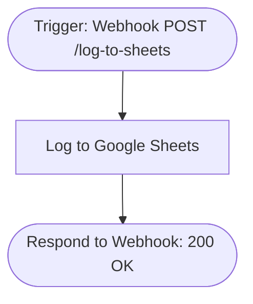

# context.md — Data - Log Webhook - Google Sheets

## Purpose
Automatically captures incoming webhook POST payloads and logs them as rows in a Google Sheet, eliminating the need to manually copy-paste data from webhook calls.

## What It Does
1. A POST request is sent to the n8n webhook endpoint `/webhook/log-to-sheets`
2. The webhook receives the request body, headers, and query parameters
3. The payload is appended as a new row in the configured Google Sheet using auto-mapping
4. A JSON success response `{"status":"ok","message":"Payload logged to Google Sheets"}` is returned to the caller

## Workflow Diagram

> Diagram auto-generated from workflow node graph at submission time.

## Tools & Connectors Used
| Tool / Service | How It's Used |
|---|---|
| n8n Webhook | Receives incoming POST requests and triggers the workflow |
| Google Sheets | Appends the incoming payload as a new row in the target sheet |
| Respond to Webhook | Returns a JSON success confirmation to the caller |

## Credentials Required
| Credential Name | Service | Notes |
|---|---|---|
| Google Sheets OAuth2 | Google Sheets | Must have edit access to the target spreadsheet |

> ⚠️ Never include credential values — names only.

## KPI Baseline
| Metric | Value |
|---|---|
| Manual time per run (before) | 5 minutes |
| Estimated runs per week | 10 |
| Projected hours saved/week | 0.83 hours |

## Risk Self-Assessment
| Risk Type | Present? | Notes |
|---|---|---|
| Handles PII / personal data | Possible | Depends on what the webhook caller sends in the body |
| Makes external API calls | Yes | Writes to Google Sheets via OAuth2 |
| Involves financial data | No | — |
| Requires human decision point | No | Fully automated |

## Submitter
**Name:** Vishal Mishra
**Email:** vishalm@devsavant.com
**Date:** 2026-06-01
**n8n Workflow ID:** xcU89kB6ADdTNSYM
**Registry ID:** 51b8e7f5-1ba6-4835-b37d-a06fd668521d
**COE Portal:** http://localhost:3000/catalog/51b8e7f5-1ba6-4835-b37d-a06fd668521d
**Instance:** shivamheaptrace.app.n8n.cloud