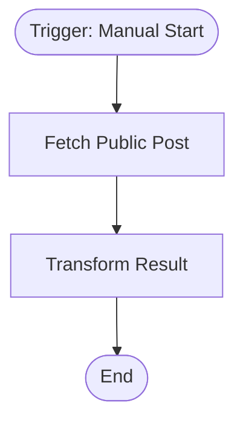

# context.md — Demo - Fetch Public Data - Transform

## Purpose
Demonstrates the full COE automation pipeline end-to-end. Fetches a post from a public REST API and transforms it into a clean structured output.

## What It Does
1. Triggered manually by a team member in n8n
2. Sends a GET request to the JSONPlaceholder public API and retrieves post #1
3. Transforms the raw API response into a clean output with `post_id`, `title`, `summary`, and `status` fields
4. Returns the structured result for downstream use or inspection

## Workflow Diagram

> Diagram auto-generated from workflow node graph at submission time.

## Tools & Connectors Used
| Tool / Service | How It's Used |
|---|---|
| JSONPlaceholder | Public test API — source of post data (no auth required) |

## Credentials Required
| Credential Name | Service | Notes |
|---|---|---|
| None | — | JSONPlaceholder is a public API; no credentials required |

> ⚠️ Never include credential values — names only.

## KPI Baseline
| Metric | Value |
|---|---|
| Manual time per run (before) | 2 minutes |
| Estimated runs per week | 5 |
| Projected hours saved/week | 0.17 hours |

## Risk Self-Assessment
| Risk Type | Present? | Notes |
|---|---|---|
| Handles PII / personal data | No | Uses synthetic public test data only |
| Makes external API calls | Yes | GET request to jsonplaceholder.typicode.com |
| Involves financial data | No | — |
| Requires human decision point | No | Fully automated |

## Submitter
**Name:** Vishal Mishra  
**Email:** vishalm@devsavant.com  
**Date:** 2026-05-27  
**n8n Workflow ID:** 9S6uSH8xHnZyx7JK  
**Registry ID:** 6e780fc9-2477-4a59-80b8-7f7154ec7931  
**Instance:** vishalmishra.app.n8n.cloud
