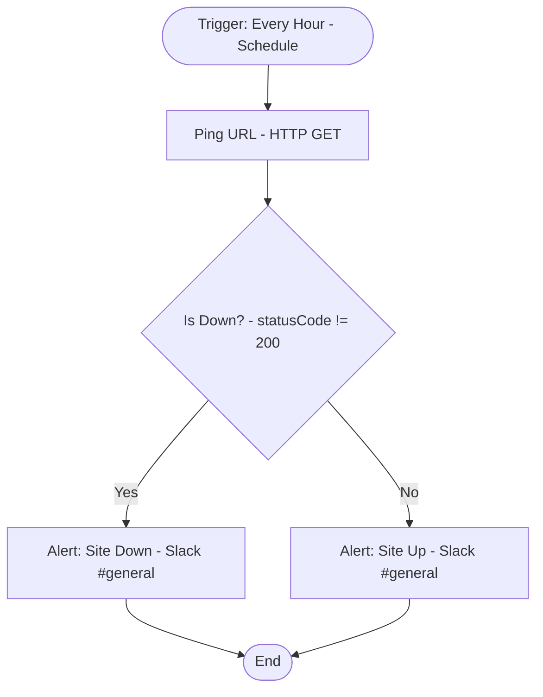

# context.md — Demo - Health Check - Slack

## Purpose
Monitors a public URL every hour and posts a Slack alert to #general when the site is down (non-200) or back up (200).

## What It Does
1. A schedule trigger fires every hour
2. An HTTP Request node pings https://httpstat.us/200 with a 5-second timeout, capturing the full response including status code
3. An IF node checks whether the status code is not equal to 200
4. If down (true branch): posts a 🚨 alert to #general with the status code and timestamp
5. If up (false branch): posts a ✅ confirmation to #general with the status code and timestamp

## Workflow Diagram

> Diagram auto-generated from workflow node graph at submission time.

## Tools & Connectors Used
| Tool / Service | How It's Used |
|---|---|
| HTTP Request | GETs https://httpstat.us/200 every hour to check availability |
| Slack | Posts down/up alerts to the #general channel |

## Credentials Required
| Credential Name | Service | Notes |
|---|---|---|
| Slack OAuth2 | Slack | Must have chat:write scope for #general |

> ⚠️ Never include credential values — names only.

## KPI Baseline
| Metric | Value |
|---|---|
| Manual time per run (before) | 5 minutes |
| Estimated runs per week | 10 |
| Projected hours saved/week | 0.83 hours |

## Risk Self-Assessment
| Risk Type | Present? | Notes |
|---|---|---|
| Handles PII / personal data | No | Only checks HTTP status codes |
| Makes external API calls | Yes | HTTP GET to httpstat.us; Slack API write |
| Involves financial data | No | — |
| Requires human decision point | No | Fully automated |

## Submitter
**Name:** Almoiz
**Email:** almoizs@heaptrace.com
**Date:** 2026-06-03
**n8n Workflow ID:** pGBTrp1kUPBP1lBn
**Registry ID:** 24be0922-e9bd-4113-8881-801eb2d1ff72
**COE Portal:** http://localhost:3000/catalog/24be0922-e9bd-4113-8881-801eb2d1ff72
**Instance:** shivamheaptrace.app.n8n.cloud