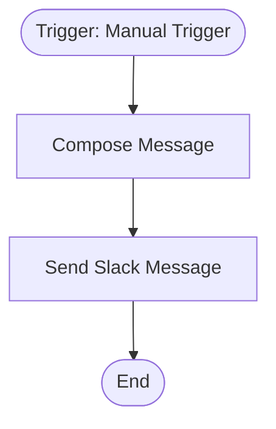

# context.md — Demo - Hello World - Slack

## Purpose
A minimal end-to-end demo workflow that validates the full COE automation pipeline — from n8n authoring through GitHub PR review to auto-publish.

## What It Does
1. A team member manually triggers the workflow from the n8n UI
2. The **Compose Message** node builds a greeting string and captures the current UTC timestamp
3. The **Send Slack Message** node posts the message to the `#general` Slack channel

## Workflow Diagram

> Diagram auto-generated from workflow node graph at submission time.

## Tools & Connectors Used
| Tool / Service | How It's Used |
|---|---|
| n8n Manual Trigger | Starts the workflow on button click |
| n8n Set node | Composes the message text and ISO timestamp |
| Slack | Posts the Hello World message to #general |

## Credentials Required
| Credential Name | Service | Notes |
|---|---|---|
| Slack OAuth2 API | Slack | Requires `chat:write` scope |
> ⚠️ Never include credential values — names only.

## KPI Baseline
| Metric | Value |
|---|---|
| Manual time per run (before) | 2 minutes |
| Estimated runs per week | 5 |
| Projected hours saved/week | 0.17 hours (~10 min) |

## Risk Self-Assessment
| Risk Type | Present? | Notes |
|---|---|---|
| Handles PII / personal data | No | — |
| Makes external API calls | Yes | Slack API (chat:write) |
| Involves financial data | No | — |
| Requires human decision point | No | Fully automated after trigger |

## Submitter
**Name:** Vishal Mishra
**Email:** vishalm@devsavant.com
**Date:** 2026-05-28
**n8n Workflow ID:** pCZFyXzgRNNzN41n
**Registry ID:** 0506325a-9235-41f6-b567-7003b0b5b14e
**Instance:** vishalmishra.app.n8n.cloud
