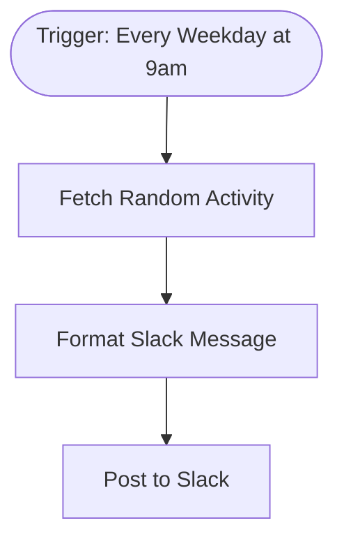

# context.md — Notifications - Morning Activity - Slack

## Purpose
This workflow brings a small daily moment of team connection to the Engineering team by automatically posting a fun activity suggestion to Slack every weekday morning. It removes the need for anyone to manually find and share an icebreaker each day.

## What It Does
1. Fires automatically every weekday (Monday–Friday) at 9:00 AM on a scheduled trigger.
2. Calls the Bored API public endpoint to fetch a random activity suggestion including its type and participant count.
3. Formats the API response into a friendly Slack-ready message with markdown formatting.
4. Posts the formatted message to the #general Slack channel as the team's daily morning icebreaker.

## Workflow Diagram

> Diagram auto-generated from workflow node graph at submission time.

## Tools & Connectors Used
| Tool / Service | How It's Used |
|---|---|
| Bored API | Public REST API called via HTTP GET to fetch a random activity suggestion with type and participant count |
| Slack | Receives the formatted morning activity message posted to the #general channel via OAuth2 |

## Credentials Required
| Credential Name | Service | Notes |
|---|---|---|
| Slack OAuth2 | Slack | Required to post messages to #general; needs chat:write scope |

> ⚠️ Never include credential values — names only.

## KPI Baseline
| Metric | Value |
|---|---|
| Manual time per run (before) | 4 minutes |
| Estimated runs per week | 35 |
| Projected hours saved/week | 2.33 hours |

## Risk Self-Assessment
| Risk Type | Present? | Notes |
|---|---|---|
| Handles PII / personal data | No | Only uses public API data; no user data processed |
| Makes external API calls | Yes | Calls Bored API (public, no auth) and Slack API (OAuth2) |
| Involves financial data | No | No financial data involved |
| Requires human decision point | No | Fully automated; no human approval needed |
| Shared automation modification risk | No | Original build; does not modify any existing shared automation |

## Submitter
**Name:** Vishal Mishra
**Email:** vishalm.mishra@fulcrumapp.com
**Date:** 2026-06-12
**n8n Workflow ID:** XvthNUBy6YQZvdg5
**Registry ID:** 25fdc7d1-db82-4913-836c-f3e6a96f9b32
**COE Portal:** https://coe-portal.devsavant.com/catalog/25fdc7d1-db82-4913-836c-f3e6a96f9b32
**Instance:** shivamheaptrace.app.n8n.cloud
**Source:** Original