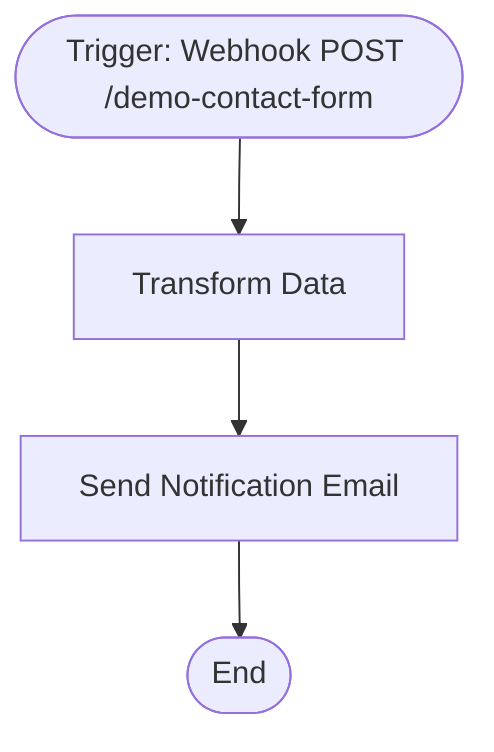

# context.md — Demo - Webhook Contact Form - Email Notify

## Purpose
Automates the handling of contact form submissions by receiving data via webhook, normalising the fields, and dispatching a formatted HTML notification email to the team inbox.

## What It Does
1. A POST request hits the `/demo-contact-form` webhook endpoint with a JSON body containing `name`, `email`, and `message`
2. The Transform Data node extracts and normalises those fields (`fullName`, `emailAddress`, `message`, `receivedAt`, `emailSubject`), handling missing fields gracefully with fallback defaults
3. The Send Notification Email node composes an HTML email and sends it via SMTP to `vishalm@devsavant.com`

## Workflow Diagram

> Diagram auto-generated from workflow node graph at submission time.

## Tools & Connectors Used
| Tool / Service | How It's Used |
|---|---|
| n8n Webhook | Receives inbound POST requests from a contact form |
| Edit Fields (Set) | Normalises and renames incoming JSON fields; adds timestamp |
| Send Email (SMTP) | Dispatches formatted HTML notification to the team |

## Credentials Required
| Credential Name | Service | Notes |
|---|---|---|
| SMTP | SMTP Email | Must have send-mail access configured in n8n |
> ⚠️ Never include credential values — names only.

## KPI Baseline
| Metric | Value |
|---|---|
| Manual time per run (before) | 5 minutes |
| Estimated runs per week | 10 |
| Projected hours saved/week | 0.83 hours |

## Risk Self-Assessment
| Risk Type | Present? | Notes |
|---|---|---|
| Handles PII / personal data | Yes | Inbound name and email address from contact form |
| Makes external API calls | Yes | SMTP outbound email |
| Involves financial data | No | — |
| Requires human decision point | No | Fully automated |

## Submitter
**Name:** Vishal Mishra
**Email:** vishalm@devsavant.com
**Date:** 2026-06-01
**n8n Workflow ID:** OsRjI5tP9zS5y8bR
**Registry ID:** 4bcfe2bc-42c9-4394-aaff-fa41db3c64f7
**COE Portal:** http://localhost:3000/catalog/4bcfe2bc-42c9-4394-aaff-fa41db3c64f7
**Instance:** shivamheaptrace.app.n8n.cloud
