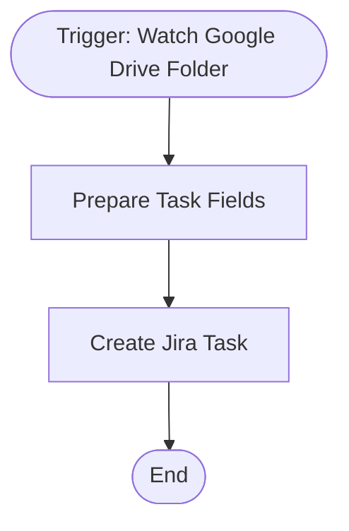

# context.md — Files: Create Jira Task from Google Drive

## Purpose
This automation removes the manual step of creating a Jira task every time a file lands in a shared Google Drive folder. It ensures the Engineering team is always notified and has a trackable ticket for every upload — without anyone having to remember to do it.

## What It Does
1. Every 5 minutes, the automation checks a designated Google Drive folder for newly uploaded files.
2. When a new file is detected, it extracts the file name, MIME type, upload timestamp, and shareable link.
3. It formats these details into a clean task summary and description.
4. It creates a new Task in the Jira **ENG** project, tagged with `google-drive` and `auto-created` labels, containing the file name, type, upload time, and a direct link to the file.

## Workflow Diagram

> Diagram auto-generated from workflow node graph at submission time.

## Tools & Connectors Used
| Tool / Service | How It's Used |
|---|---|
| Google Drive | Polls a specific folder every 5 minutes to detect newly uploaded files |
| Jira | Creates a new Task in the ENG project for each detected file |

## Credentials Required
| Credential Name | Service | Notes |
|---|---|---|
| Google Drive OAuth2 | Google Drive | Shared OAuth2 connection with read-only access to the monitored folder |
| Jira Cloud API | Jira | Shared API token with write access to create issues in the ENG project |
> ⚠️ Never include credential values — names only.

## KPI Baseline
| Metric | Value |
|---|---|
| Manual time per run (before) | 4 minutes |
| Estimated runs per week | 7 |
| Projected hours saved/week | 0.47 hours |

## Risk Self-Assessment
| Risk Type | Present? | Notes |
|---|---|---|
| Handles PII / personal data | No | Only file metadata is processed — no file contents are read |
| Makes external API calls | Yes | Calls Google Drive API (polling) and Jira Cloud API (issue creation) |
| Involves financial data | No | No financial data involved |
| Requires human decision point | No | Fully automated — no human in the loop |
| Shared automation modification risk | No | Original build — not a modification of an existing shared automation |

## Submitter
**Name:** Vishal Mishra
**Email:** vishalm.mishra@fulcrumapp.com
**Date:** 2026-06-12
**n8n Workflow ID:** k8Y8SXrNH7VyNgGU
**Registry ID:** 81f2e565-6b7a-4c49-9165-ef4a93345bfd
**COE Portal:** https://coe-portal.devsavant.com/catalog/81f2e565-6b7a-4c49-9165-ef4a93345bfd
**Instance:** shivamheaptrace.app.n8n.cloud
**Source:** Original