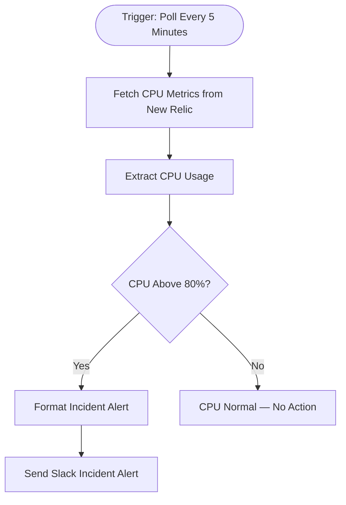

# context.md — Infrastructure - CPU Anomaly Detection - Slack

## Purpose
This workflow solves the problem of delayed incident response for the Engineering team by automatically detecting abnormal server CPU usage and escalating immediately via Slack — without anyone needing to manually monitor dashboards.

## What It Does
1. **Triggers every 5 minutes** on a fixed schedule to poll server metrics
2. **Fetches CPU usage data** from New Relic's API for the production application
3. **Extracts key fields** — CPU percentage, app name, app ID, and timestamp
4. **Evaluates the threshold** — checks whether CPU usage is above 80%
5. **Formats an incident alert** with all relevant context if the threshold is breached
6. **Sends a Slack alert** to the #incidents channel with app name, CPU %, timestamp, and a call to action
7. **Logs a no-action status** if CPU is normal — no alert sent

## Workflow Diagram

> Diagram derived from workflow node graph at submission time.

## Tools & Connectors Used
| Tool / Service | How It's Used |
|---|---|
| New Relic | Queried via REST API every 5 minutes to retrieve the CPU average for the production application |
| Slack | Receives a formatted incident alert message in the #incidents channel when CPU exceeds 80% |

## Credentials Required
| Credential Name | Service | Notes |
|---|---|---|
| New Relic API Key | New Relic | Header Auth credential — set header name to `Api-Key` |
| Slack Bot Token | Slack | Bot token with `chat:write` and `channels:read` scopes |

> ⚠️ Never include credential values — names only.

## KPI Baseline
| Metric | Value |
|---|---|
| Manual time per run (before) | 4 minutes |
| Estimated runs per week | 7 |
| Projected hours saved/week | 0.47 hours |

## Risk Self-Assessment
| Risk Type | Present? | Notes |
|---|---|---|
| Handles PII / personal data | No | Only server metrics (CPU %) are processed — no user data involved |
| Makes external API calls | Yes | Calls New Relic REST API and Slack API on every run |
| Involves financial data | No | Infrastructure metrics only |
| Requires human decision point | No | Alert is fully automated; human response happens after Slack notification |
| Shared automation modification risk | Yes | Uses shared team credentials — changes affect all Engineering team users |

## Submitter
**Name:** Vishal Mishra
**Email:** vishalm.mishra@fulcrumapp.com
**Date:** 2026-06-11
**n8n Workflow ID:** bb5EzN1QA31Sitko
**Registry ID:** 868e9c6c-9e1e-4874-ba0c-046034bdcd7c
**COE Portal:** https://coe-portal.devsavant.com/catalog/868e9c6c-9e1e-4874-ba0c-046034bdcd7c
**Instance:** shivamheaptrace.app.n8n.cloud
**Source:** Original