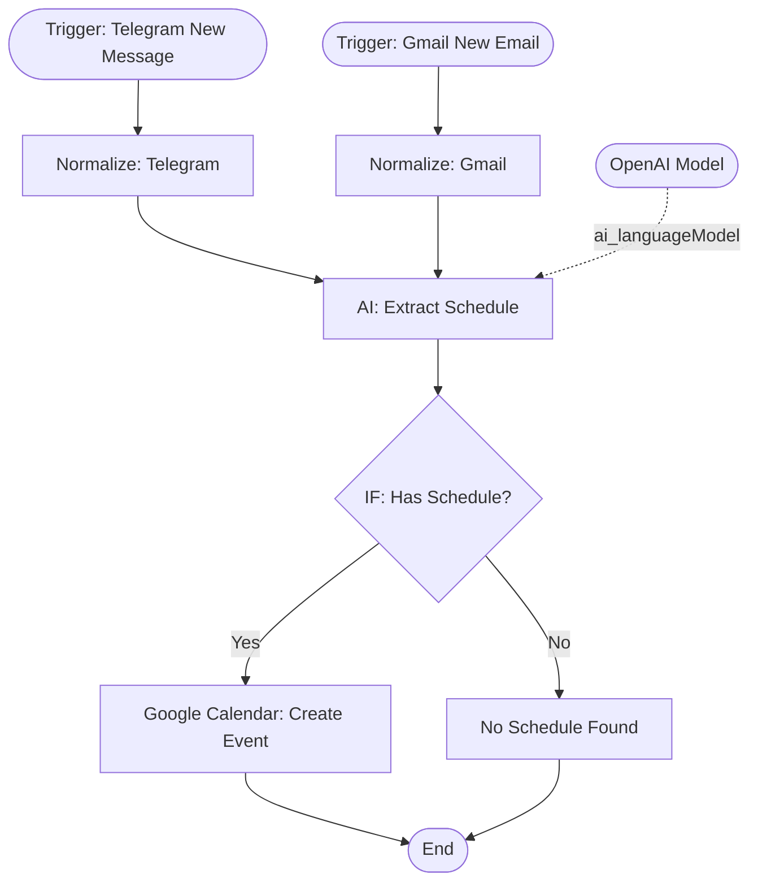

# context.md — Messaging - Schedule Sync - Google Calendar

## Purpose
Eliminates manual calendar entry by automatically detecting schedule mentions in Telegram messages and Gmail emails, extracting the event details via AI, and creating Google Calendar events directly.

## What It Does
1. Listens for every new Telegram message sent to the configured bot
2. Polls Gmail every hour for new emails
3. Normalises each source into a common `messageText` field
4. Passes the text to GPT-5-mini (Information Extractor) which detects whether the message contains a schedulable event and extracts title, start/end datetime (IST), location, and description
5. If a schedule is detected, creates a Google Calendar event on the primary calendar with the source tagged in the description (e.g. `[From: Telegram] Project kickoff`)
6. If no schedule is detected, the execution ends silently — no noise

## Workflow Diagram

> Diagram derived from workflow node graph at submission time (workflow ID: 165zy4HYEoaJpUdC).

## Tools & Connectors Used
| Tool / Service | How It's Used |
|---|---|
| Telegram | Source — listens for new messages via bot trigger |
| Gmail | Source — polls for new emails every hour |
| OpenAI (GPT-5-mini) | AI extraction — detects and parses schedule details from message text |
| Google Calendar | Destination — creates event on the user's primary calendar |

## Credentials Required
| Credential Name | Service | Notes |
|---|---|---|
| Telegram API | Telegram | Bot token from @BotFather. Bot must be added to the relevant chat. |
| Gmail OAuth2 | Gmail | OAuth2 with `gmail.readonly` scope |
| OpenAI | OpenAI | API key with GPT-5-mini access |
| Google Calendar OAuth2 | Google Calendar | OAuth2 with `calendar.events` scope |
> ⚠️ Never include credential values — names only.

## KPI Baseline
| Metric | Value |
|---|---|
| Manual time per run (before) | 20 minutes |
| Estimated runs per week | 10 |
| Projected hours saved/week | 3.3 hours |

## Risk Self-Assessment
| Risk Type | Present? | Notes |
|---|---|---|
| Handles PII / personal data | Yes | Message text from Telegram and Gmail is passed to OpenAI for processing |
| Makes external API calls | Yes | OpenAI (extraction), Google Calendar (write) |
| Involves financial data | No | — |
| Requires human decision point | No | Fully automated; false positives create spurious calendar events |

## Submitter
**Name:** Vishal Mishra  
**Email:** vishalm@devsavant.com  
**Date:** 2026-05-28  
**n8n Workflow ID:** 165zy4HYEoaJpUdC  
**Registry ID:** ffaab575-938b-4366-914d-6bdc3a0a6097  
**Instance:** vishalmishra.app.n8n.cloud
