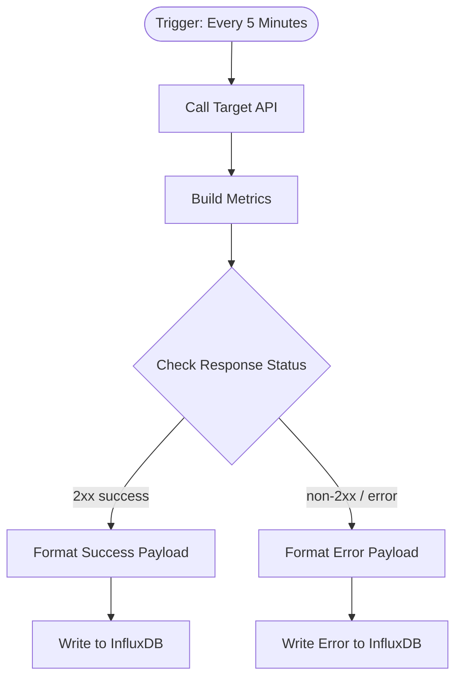

# context.md — Monitoring - API Response Time - InfluxDB

## Purpose
This workflow automates the continuous monitoring of an API endpoint's availability and response status, eliminating the need for manual checks and ensuring the Engineering team has a persistent time-series record in InfluxDB for alerting and dashboards.

## What It Does
1. **Schedule Trigger** — fires every 5 minutes automatically
2. **Call Target API** — sends a GET request to `jsonplaceholder.typicode.com/posts/1` and captures the full HTTP response including status code
3. **Build Metrics** — extracts the status code, records the current timestamp in ISO format, and computes a nanosecond-precision timestamp for InfluxDB
4. **Check Response Status** — evaluates whether the HTTP status code is in the 2xx success range
5. **Format Success Payload** — on a successful response, formats an InfluxDB Line Protocol string with `status=success` tag
6. **Format Error Payload** — on a non-2xx response, formats an InfluxDB Line Protocol string with `status=error` tag
7. **Write to InfluxDB / Write Error to InfluxDB** — POSTs the Line Protocol metric to the InfluxDB v2 write API, routing success and error metrics through separate nodes

## Workflow Diagram

> Diagram auto-generated from workflow node graph at submission time.

## Tools & Connectors Used
| Tool / Service | How It's Used |
|---|---|
| JSONPlaceholder API | Sample public REST API endpoint used as the monitoring target — GET request to `/posts/1` |
| InfluxDB | Time-series database that receives the metric datapoints written via the InfluxDB v2 HTTP write API using Line Protocol format |

## Credentials Required
| Credential Name | Service | Notes |
|---|---|---|
| InfluxDB API Token | InfluxDB | Bearer token used to authenticate writes to the InfluxDB v2 `/api/v2/write` endpoint |

> ⚠️ Never include credential values — names only.

## KPI Baseline
| Metric | Value |
|---|---|
| Manual time per run (before) | 4 minutes |
| Estimated runs per week | 7 |
| Projected hours saved/week | 0.47 hours |

## Risk Self-Assessment
| Risk Type | Present? | Notes |
|---|---|---|
| Handles PII / personal data | No | Only monitors API response status codes — no user data involved |
| Makes external API calls | Yes | Calls JSONPlaceholder API (read) and InfluxDB write API on every run |
| Involves financial data | No | No financial data is read or written |
| Requires human decision point | No | Fully automated — no human approval step in the flow |
| Could be modified by shared team members | Yes | Uses shared InfluxDB credentials — any team member with access could update the target URL or bucket config |

## Submitter
**Name:** Vishal Mishra
**Email:** vishalm.mishra@fulcrumapp.com
**Date:** 2026-06-12
**n8n Workflow ID:** KxvO5g1ArBg5mVK9
**Registry ID:** 56cf340e-5d18-426e-b6b3-7efdf6c8b241
**COE Portal:** https://coe-portal.devsavant.com/catalog/56cf340e-5d18-426e-b6b3-7efdf6c8b241
**Instance:** shivamheaptrace.app.n8n.cloud
**Source:** Original