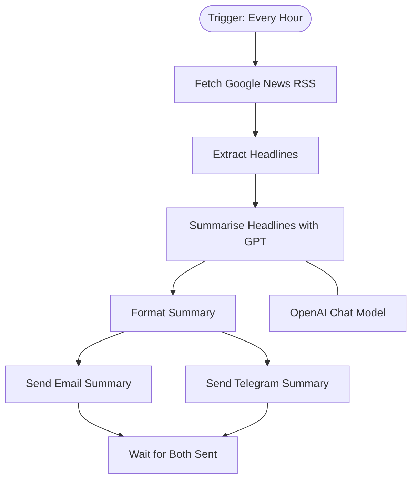

# context.md — News - Summarise Google News - Email & Telegram

## Purpose
This workflow automates the task of monitoring Google News and distributing a concise headline summary to the Engineering team every hour. It eliminates the need for team members to manually check news and write summaries.

## What It Does
1. Runs automatically every hour via a schedule trigger
2. Fetches the Google News RSS feed and extracts the top 10 headlines
3. Passes the headlines to GPT, which produces a concise bullet-point summary
4. Formats the summary with a timestamp
5. In parallel, sends the formatted summary as an HTML email to gaurav.shakya@fulcrumapp.com AND as a Telegram message to the @demo channel
6. Waits for both delivery confirmations before completing

## Workflow Diagram

> Diagram derived from workflow node graph at submission time.

## Tools & Connectors Used
| Tool / Service | How It's Used |
|---|---|
| Google News | RSS feed fetched via HTTP to retrieve the latest top headlines |
| OpenAI | GPT model summarises the raw headlines into a concise bullet-point list |
| Gmail | Sends the formatted HTML summary email to the recipient each run |
| Telegram | Sends the formatted Markdown summary to the @demo channel each run |

## Credentials Required
| Credential Name | Service | Notes |
|---|---|---|
| OpenAI API | OpenAI | API key for GPT chat completions |
| Gmail OAuth2 | Gmail | OAuth2 for sending email via the shared Gmail account |
| Telegram Bot API | Telegram | Bot token for sending messages to the @demo channel |

> ⚠️ Never include credential values — names only.

## KPI Baseline
| Metric | Value |
|---|---|
| Manual time per run (before) | 45 minutes |
| Estimated runs per week | 3 |
| Projected hours saved/week | 2.25 hours |

## Risk Self-Assessment
| Risk Type | Present? | Notes |
|---|---|---|
| Handles PII / personal data | No | Only public news headlines are processed |
| Makes external API calls | Yes | Calls Google News RSS, OpenAI API, Gmail API, and Telegram Bot API |
| Involves financial data | No | No financial data involved |
| Requires human decision point | No | Fully automated end-to-end |
| Shared automation modification risk | No | Original build — no shared automation modified |

## Submitter
**Name:** Gaurav Shakya
**Email:** gaurav.shakya@fulcrumapp.com
**Date:** 2026-06-11
**n8n Workflow ID:** 0H6Y3rSCTxia3PaW
**Registry ID:** dbd5958a-4ed1-4c3e-86b8-3fdd0198f16b
**COE Portal:** https://coe-portal.devsavant.com/catalog/dbd5958a-4ed1-4c3e-86b8-3fdd0198f16b
**Instance:** shivamheaptrace.app.n8n.cloud
**Source:** Original