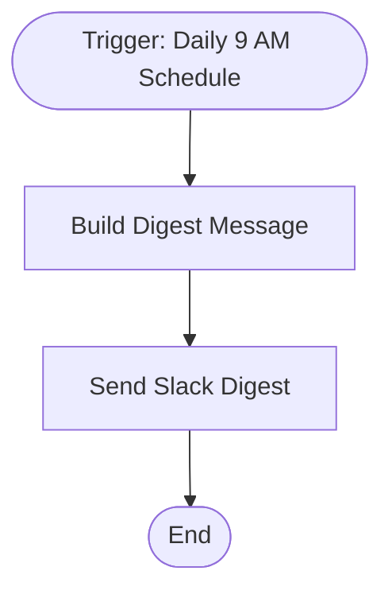

# context.md — Notifications - Daily Digest - Slack

## Purpose
Eliminates the manual effort of sending daily morning stand-up reminders by automatically posting a formatted digest to the #general Slack channel every weekday at 9 AM.

## What It Does
1. A Schedule Trigger fires daily at 9:00 AM
2. The "Build Digest Message" node composes a greeting message containing today's date, three standing team reminders (open tasks, pending approvals, standup time), and a closing note
3. The "Send Slack Digest" node posts the composed message to the #general Slack channel via OAuth2

## Workflow Diagram

> Diagram derived from workflow node graph at submission time.

## Tools & Connectors Used
| Tool / Service | How It's Used |
|---|---|
| n8n Schedule Trigger | Fires the workflow every day at 09:00 |
| n8n Set Node | Builds the formatted message text with dynamic date |
| Slack | Posts the digest to the #general channel |

## Credentials Required
| Credential Name | Service | Notes |
|---|---|---|
| Slack OAuth2 | Slack | Requires `chat:write` and `channels:read` scopes |
> ⚠️ Never include credential values — names only.

## KPI Baseline
| Metric | Value |
|---|---|
| Manual time per run (before) | 5 minutes |
| Estimated runs per week | 5 |
| Projected hours saved/week | 0.42 hours (~25 min) |

## Risk Self-Assessment
| Risk Type | Present? | Notes |
|---|---|---|
| Handles PII / personal data | No | Message contains no personal data |
| Makes external API calls | Yes | Slack API (post message) |
| Involves financial data | No | — |
| Requires human decision point | No | Fully automated |

## Submitter
**Name:** Shivam
**Email:** shivams@heaptrace.com
**Date:** 2026-06-01
**n8n Workflow ID:** klMVReg3sQvUq5T9
**Registry ID:** 0d5d1816-e69a-4c56-972e-384f6ea70f88
**COE Portal:** http://localhost:3000/catalog/0d5d1816-e69a-4c56-972e-384f6ea70f88
**Instance:** shivamheaptrace.app.n8n.cloud
