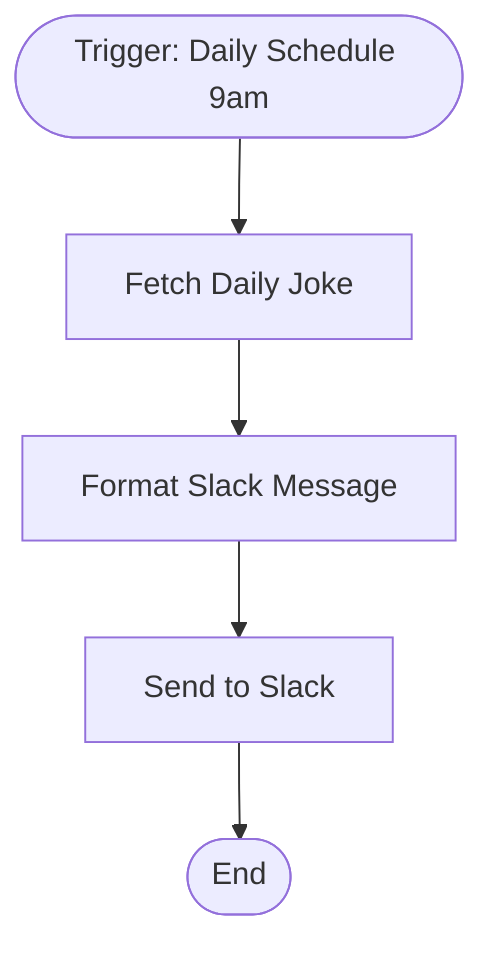

# context.md — Notifications - Daily Joke - Slack

## Purpose
Sends a random joke to the Slack #general channel every weekday morning at 9am to boost team morale — no manual effort required.

## What It Does
1. The Schedule Trigger fires every day at 9:00am
2. The HTTP Request node fetches a random joke (setup + punchline) from the public Official Joke API
3. The Format Slack Message node builds a nicely formatted markdown message
4. The Send to Slack node posts the message to the #general channel

## Workflow Diagram

> Diagram auto-generated from workflow node graph at submission time.

## Tools & Connectors Used
| Tool / Service | How It's Used |
|---|---|
| Official Joke API | Source of random joke data (setup + punchline) via public REST endpoint |
| Slack | Posts the formatted joke message to #general |

## Credentials Required
| Credential Name | Service | Notes |
|---|---|---|
| Slack OAuth2 | Slack | Must have `chat:write` scope to post messages |
> ⚠️ Never include credential values — names only.

## KPI Baseline
| Metric | Value |
|---|---|
| Manual time per run (before) | 5 minutes |
| Estimated runs per week | 5 |
| Projected hours saved/week | 0.42 hours |

## Risk Self-Assessment
| Risk Type | Present? | Notes |
|---|---|---|
| Handles PII / personal data | No | — |
| Makes external API calls | Yes | Official Joke API (public, no auth) and Slack API |
| Involves financial data | No | — |
| Requires human decision point | No | Fully automated |

## Submitter
**Name:** Vishal Mishra
**Email:** vishalm@devsavant.com
**Date:** 2026-06-01
**n8n Workflow ID:** cV0mCRUtNF4qUVtD
**Registry ID:** c341c486-8392-4eae-8ea5-8fc11ce1b411
**COE Portal:** http://localhost:3000/catalog/c341c486-8392-4eae-8ea5-8fc11ce1b411
**Instance:** vishalmishra.app.n8n.cloud
