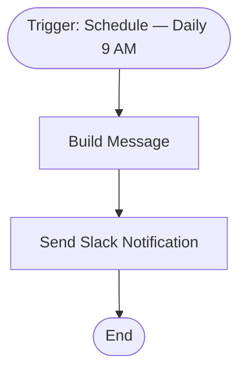

# context.md — Notifications - Daily Morning Standup - Slack

## Purpose
Automatically posts a friendly good morning message to the team's #general Slack channel every day at 9 AM, replacing the need for anyone to send it manually.

## What It Does
1. A schedule trigger fires every day at 09:00
2. A Set node builds the message text, dynamically inserting today's date using an n8n expression
3. The Slack node posts the composed message to the #general channel via the Slack OAuth2 API

## Workflow Diagram

> Diagram auto-generated from workflow node graph at submission time.

## Tools & Connectors Used
| Tool / Service | How It's Used |
|---|---|
| n8n Schedule Trigger | Fires the workflow every day at 09:00 |
| n8n Set Node | Builds the message string with dynamic date |
| Slack | Posts the message to the #general channel |

## Credentials Required
| Credential Name | Service | Notes |
|---|---|---|
| Slack OAuth2 | Slack | Must have `chat:write` and `channels:read` scope |
> ⚠️ Never include credential values — names only.

## KPI Baseline
| Metric | Value |
|---|---|
| Manual time per run (before) | 5 minutes |
| Estimated runs per week | 5 |
| Projected hours saved/week | 0.42 hours |

## Risk Self-Assessment
| Risk Type | Present? | Notes |
|---|---|---|
| Handles PII / personal data | No | Message contains only date and static text |
| Makes external API calls | Yes | Slack API (chat.postMessage) |
| Involves financial data | No | — |
| Requires human decision point | No | Fully automated |

## Submitter
**Name:** Vishal Mishra
**Email:** vishalm@devsavant.com
**Date:** 2026-06-01
**n8n Workflow ID:** QBTrGynvj75pBVIW
**Registry ID:** 379e33e4-24c6-46a0-8f90-13bb571b4f23
**COE Portal:** http://localhost:3000/catalog/379e33e4-24c6-46a0-8f90-13bb571b4f23
**Instance:** shivamheaptrace.app.n8n.cloud
