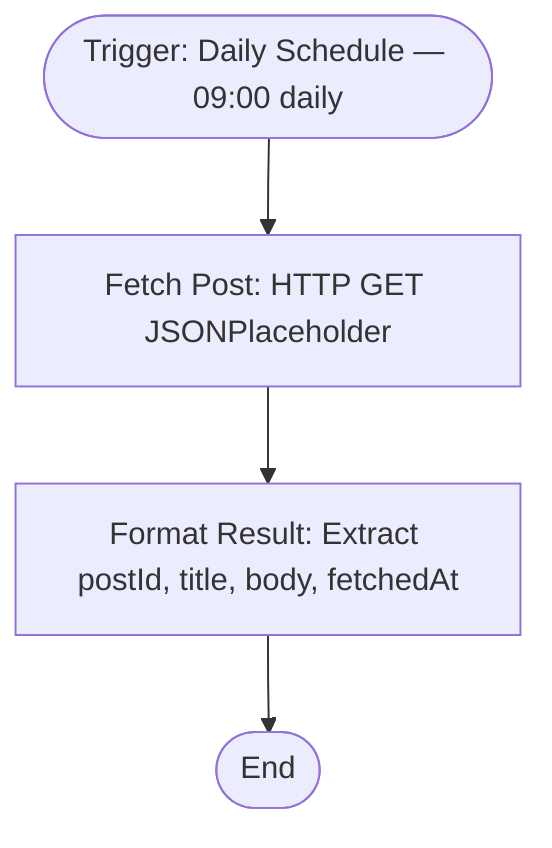

# context.md — Notifications - Daily Post Fetch - JSONPlaceholder

## Purpose
This sample workflow demonstrates the full COE build-and-publish pipeline by fetching a post from the public JSONPlaceholder API each day at 9 AM and emitting a clean, structured output record.

## What It Does
1. A Schedule Trigger fires every day at 09:00
2. An HTTP Request node calls `GET https://jsonplaceholder.typicode.com/posts/1`
3. An Edit Fields (Set) node extracts and renames four fields: `postId`, `title`, `body`, and `fetchedAt`

## Workflow Diagram

> Diagram auto-generated from workflow node graph at submission time.

## Tools & Connectors Used
| Tool / Service | How It's Used |
|---|---|
| JSONPlaceholder API | Public REST API — source of sample post data (no auth required) |

## Credentials Required
| Credential Name | Service | Notes |
|---|---|---|
| None | — | JSONPlaceholder is a public API requiring no credentials |

> ⚠️ Never include credential values — names only.

## KPI Baseline
| Metric | Value |
|---|---|
| Manual time per run (before) | 5 minutes |
| Estimated runs per week | 7 |
| Projected hours saved/week | 0.58 hours |

## Risk Self-Assessment
| Risk Type | Present? | Notes |
|---|---|---|
| Handles PII / personal data | No | Uses only public placeholder data |
| Makes external API calls | Yes | GET https://jsonplaceholder.typicode.com/posts/1 |
| Involves financial data | No | — |
| Requires human decision point | No | Fully automated |

## Submitter
**Name:** Vishal Mishra
**Email:** vishalm@devsavant.com
**Date:** 2026-06-01
**n8n Workflow ID:** PwakGcfVd89gry3F
**Registry ID:** 3a2b997f-5326-44f0-b7c1-3559c49e6813
**COE Portal:** http://localhost:3000/catalog/3a2b997f-5326-44f0-b7c1-3559c49e6813
**Instance:** vishalmishra.app.n8n.cloud
