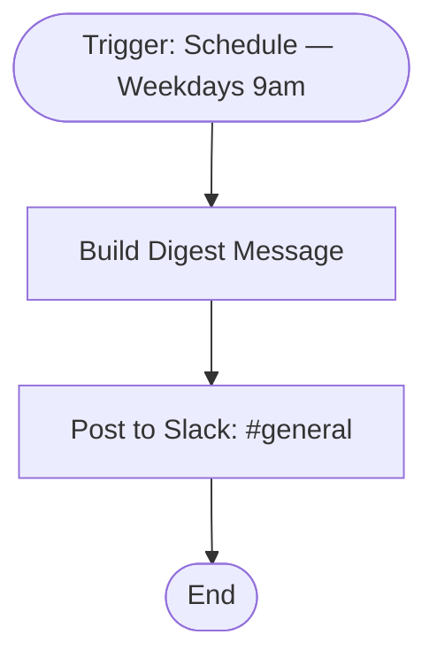

# context.md — Notifications - Daily Standup Digest - Slack

## Purpose
Eliminates the manual effort of posting a daily standup prompt to Slack each weekday morning. Keeps the team aligned without anyone having to remember to do it.

## What It Does
1. The Schedule Trigger fires every weekday (Monday–Friday) at 9:00 AM
2. The **Build Digest Message** node constructs a formatted Slack message with the current date and standup prompts for task reviews, blockers, and wins
3. The **Post to Slack** node sends the message to the `#general` channel using Slack OAuth2

## Workflow Diagram

> Diagram derived from workflow node graph at submission time.

## Tools & Connectors Used
| Tool / Service | How It's Used |
|---|---|
| n8n Schedule Trigger | Fires every Mon–Fri at 09:00 |
| Edit Fields (Set) | Builds the formatted message string with today's date |
| Slack | Posts the standup digest to `#general` |

## Credentials Required
| Credential Name | Service | Notes |
|---|---|---|
| Slack OAuth2 | Slack | Requires `chat:write` and `channels:read` scopes |
> ⚠️ Never include credential values — names only.

## KPI Baseline
| Metric | Value |
|---|---|
| Manual time per run (before) | 5 minutes |
| Estimated runs per week | 5 |
| Projected hours saved/week | 0.42 hours (~25 min) |

## Risk Self-Assessment
| Risk Type | Present? | Notes |
|---|---|---|
| Handles PII / personal data | No | Message is static text only |
| Makes external API calls | Yes | Slack API (post message) |
| Involves financial data | No | — |
| Requires human decision point | No | Fully automated |

## Submitter
**Name:** Vishal Mishra
**Email:** vishalm@devsavant.com
**Date:** 2026-06-01
**n8n Workflow ID:** VbnzisKyJLXAfnlO
**Registry ID:** befc0282-8582-4db0-80a5-b773d904a569
**COE Portal:** http://localhost:3000/catalog/befc0282-8582-4db0-80a5-b773d904a569
**Instance:** shivamheaptrace.app.n8n.cloud
