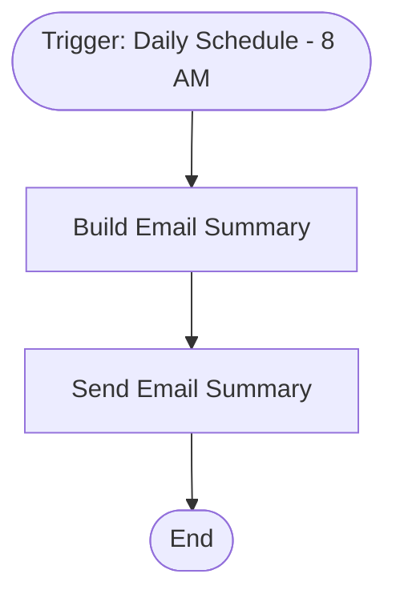

# context.md — Notifications - Email Summary - Schedule

## Purpose
Automates the daily composition and delivery of an HTML email summary, eliminating the need for manual email drafting every morning.

## What It Does
1. Fires every day at 08:00 AM on a schedule
2. Builds a dynamic HTML email subject and body using the current date
3. Sends the HTML email to vishalm@devsavant.com via Gmail

## Workflow Diagram

> Diagram auto-generated from workflow node graph at submission time.

## Tools & Connectors Used
| Tool / Service | How It's Used |
|---|---|
| Schedule Trigger | Fires the workflow daily at 8:00 AM |
| Edit Fields (Set) | Dynamically builds the email subject and HTML body with today's date |
| Gmail | Sends the composed HTML email to vishalm@devsavant.com |

## Credentials Required
| Credential Name | Service | Notes |
|---|---|---|
| Gmail OAuth2 | Gmail | Must have gmail.send scope |
> ⚠️ Never include credential values — names only.

## KPI Baseline
| Metric | Value |
|---|---|
| Manual time per run (before) | 5 minutes |
| Estimated runs per week | 10 |
| Projected hours saved/week | 0.83 hours |

## Risk Self-Assessment
| Risk Type | Present? | Notes |
|---|---|---|
| Handles PII / personal data | No | Email address is internal only |
| Makes external API calls | Yes | Gmail API via OAuth2 |
| Involves financial data | No | — |
| Requires human decision point | No | Fully automated |

## Submitter
**Name:** Vishal Mishra  
**Email:** vishalm@devsavant.com  
**Date:** 2026-05-28  
**n8n Workflow ID:** qw0FJYszLkQmDZPz  
**Registry ID:** a91594db-fb1c-4fa9-9a24-5eac079d3441  
**Instance:** vishalmishra.app.n8n.cloud
