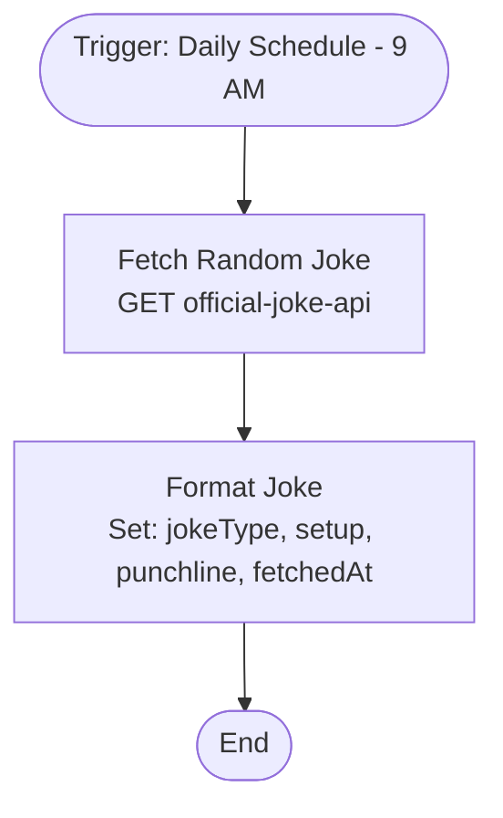

# context.md — Notifications - Fetch Daily Joke - Log

## Purpose
Fetches a random joke from a public API on a daily schedule and formats the result into structured output fields for downstream use or logging.

## What It Does
1. Triggers automatically every day at 9:00 AM via the Schedule Trigger
2. Makes a GET request to the Official Joke API (`https://official-joke-api.appspot.com/random_joke`)
3. Extracts and formats the joke's `type`, `setup`, `punchline`, and a `fetchedAt` timestamp into clean output fields

## Workflow Diagram

> Diagram auto-generated from workflow node graph at submission time.

## Tools & Connectors Used
| Tool / Service | How It's Used |
|---|---|
| Schedule Trigger | Fires the workflow every day at 9:00 AM |
| HTTP Request | Calls the Official Joke API to fetch a random joke |
| Edit Fields (Set) | Extracts and renames joke fields into structured output |

## Credentials Required
No credentials required — the Official Joke API is a public, unauthenticated endpoint.

## KPI Baseline
| Metric | Value |
|---|---|
| Manual time per run (before) | 2 minutes |
| Estimated runs per week | 7 |
| Projected hours saved/week | 0.23 hours (~14 minutes) |

## Risk Self-Assessment
| Risk Type | Present? | Notes |
|---|---|---|
| Handles PII / personal data | No | Joke content only |
| Makes external API calls | Yes | Official Joke API (public, no auth) |
| Involves financial data | No | — |
| Requires human decision point | No | Fully automated |

## Submitter
**Name:** Vishal Mishra
**Email:** vishalm@devsavant.com
**Date:** 2026-06-02
**n8n Workflow ID:** SHRjd6Hfb5XSmmpS
**Registry ID:** 27068091-18e5-49fa-b921-8fa1272a84aa
**COE Portal:** http://localhost:3000/catalog/27068091-18e5-49fa-b921-8fa1272a84aa
**Instance:** vishalmishra.app.n8n.cloud