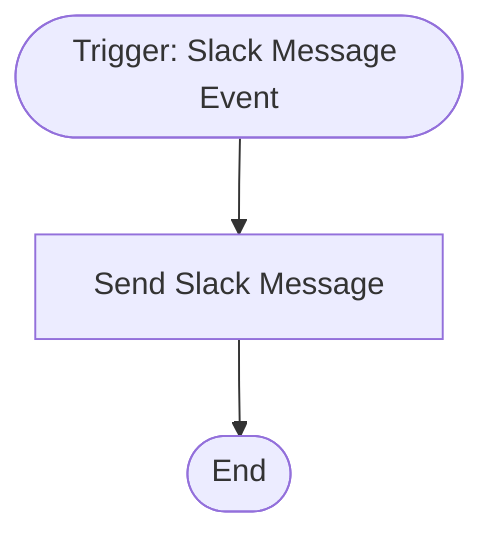

# context.md — Notifications - Slack Event Reply - Demo

## Purpose
Demonstrates how to listen for new Slack messages in a workspace and automatically send a formatted acknowledgement reply back to the originating channel.

## What It Does
1. The **Slack Event Trigger** listens for new `message` events across the entire workspace via Slack's Events API webhook.
2. When a message is received, the trigger outputs the event payload including the channel ID, sending user, message text, and timestamp.
3. The **Send Slack Message** node posts a formatted reply back into the same channel, echoing the event type, the sender's user mention, and the original message text.

## Workflow Diagram

> Diagram auto-generated from workflow node graph at submission time.
> Each box represents an n8n node in execution order.
> Rounded boxes mark the trigger and terminal nodes.

## Tools & Connectors Used
| Tool / Service | How It's Used |
|---|---|
| Slack | Source of inbound message events (Slack Event Trigger) |
| Slack | Destination for formatted acknowledgement reply (Slack node — message post) |

## Credentials Required
| Credential Name | Service | Notes |
|---|---|---|
| Slack API | Slack | Must have `channels:read`, `chat:write`, and Events API webhook configured |
> ⚠️ Never include credential values — names only.

## KPI Baseline
| Metric | Value |
|---|---|
| Manual time per run (before) | ~2 minutes (manual copy-paste acknowledgement) |
| Estimated runs per month | 200 |
| Projected hours saved/month | ~6.7 hours |

## Risk Self-Assessment
| Risk Type | Present? | Notes |
|---|---|---|
| Handles PII / personal data | Yes | Slack user IDs and message text are processed |
| Makes external API calls | Yes | Slack Events API (inbound) + Slack API (outbound post) |
| Involves financial data | No | — |
| Requires human decision point | No | Fully automated |

## Submitter
**Name:** devsavant team  
**Date:** 2026-05-21  
**n8n Workflow ID:** nUN3wyphPZdfbjvf  
**Instance:** vishalmishra.app.n8n.cloud
