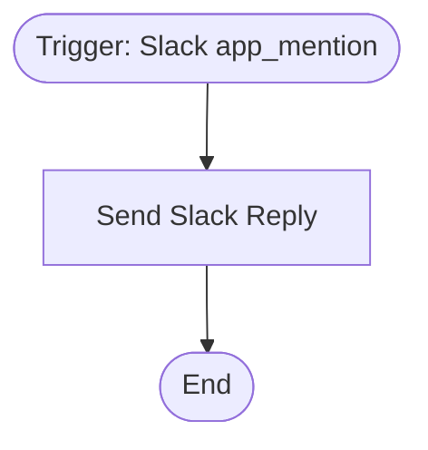

# context.md — Notifications - Slack Event Reply - Demo

## Purpose
This demo workflow automates replies to Slack app mentions, instantly responding in the same channel without any manual intervention.

## What It Does
1. The **Slack Event Trigger** node listens workspace-wide for `app_mention` events — fired whenever a user mentions the Slack bot.
2. The **Send Slack Reply** node posts a formatted acknowledgement message back to the same channel where the mention occurred, including the original text of the mention in the reply.

## Workflow Diagram

> Diagram auto-generated from workflow node graph at submission time.
> Each box represents an n8n node in execution order.
> Rounded boxes mark the trigger and terminal nodes.

## Tools & Connectors Used
| Tool / Service | How It's Used |
|---|---|
| Slack | Trigger: listens for `app_mention` events across the workspace |
| Slack | Action: posts a reply message to the originating channel |

## Credentials Required
| Credential Name | Service | Notes |
|---|---|---|
| Slack API | Slack | Must have `app_mentions:read` (for trigger) and `chat:write` (for posting) OAuth scopes |
> ⚠️ Never include credential values — names only.

## KPI Baseline
| Metric | Value |
|---|---|
| Manual time per reply (before) | ~2 minutes |
| Estimated mentions per month | ~200 |
| Projected hours saved/month | ~6.6 hours |

## Risk Self-Assessment
| Risk Type | Present? | Notes |
|---|---|---|
| Handles PII / personal data | No | Only processes public channel message text |
| Makes external API calls | Yes | Slack API (read event + post message) |
| Involves financial data | No | — |
| Requires human decision point | No | Fully automated reply |

## Submitter
**Name:** Vishal Mishra  
**Date:** 2026-05-21  
**n8n Workflow ID:** UeIlfzr5WftycXbY  
**Instance:** vishalmishra.app.n8n.cloud
