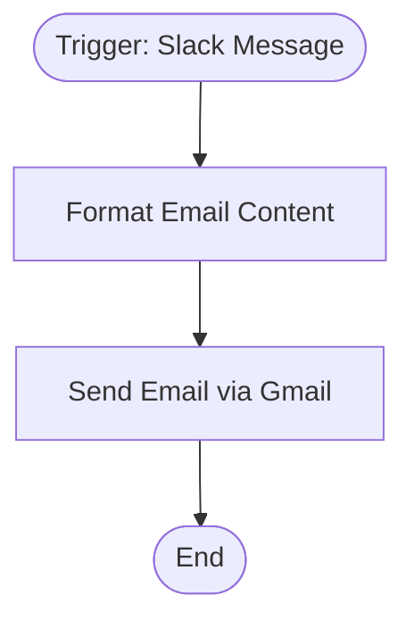

# context.md — Notifications - Slack Messages - Gmail

## Purpose
Automatically forward Slack workspace messages to a team email address via Gmail, ensuring no important chat communications are missed by team members who prefer email.

## What It Does
1. Listens for any new message posted anywhere in the Slack workspace via the Slack Events API
2. Extracts the message text, sender user ID, and channel ID from the Slack event payload
3. Formats the data into a structured HTML email with sender, channel, and message content
4. Sends the formatted email to `team@devsavant.com` via Gmail OAuth2

## Workflow Diagram

> Diagram auto-generated from workflow node graph at submission time.
> Each box represents an n8n node in execution order.
> Rounded boxes mark the trigger and terminal nodes.

## Tools & Connectors Used
| Tool / Service | How It's Used |
|---|---|
| Slack | Source of message events via Slack Events API webhook (watches entire workspace) |
| Gmail | Sends formatted HTML email to team@devsavant.com via OAuth2 |

## Credentials Required
| Credential Name | Service | Notes |
|---|---|---|
| Slack API | Slack | Must have `message.channels`, `message.groups`, `message.im`, `message.mpim` event subscriptions enabled |
| Gmail OAuth2 | Gmail | Must have Gmail send scope (`https://www.googleapis.com/auth/gmail.send`) |

> ⚠️ Never include credential values — names only.

## KPI Baseline
| Metric | Value |
|---|---|
| Manual time per forwarding (before) | ~2 minutes (copy-paste from Slack to email) |
| Estimated message forwards per month | ~200 |
| Projected hours saved/month | ~6.7 hours |

## Risk Self-Assessment
| Risk Type | Present? | Notes |
|---|---|---|
| Handles PII / personal data | Yes | Slack messages may contain personal content; email is sent to team inbox only |
| Makes external API calls | Yes | Slack Events API (inbound webhook) + Gmail API (outbound send) |
| Involves financial data | No | — |
| Requires human decision point | No | Fully automated; no approval gate |

## Submitter
**Name:** devsavant.com team
**Date:** 2026-05-22
**n8n Workflow ID:** 0h5dHyEGc4U4B5jR
**Instance:** vishalmishra.app.n8n.cloud
