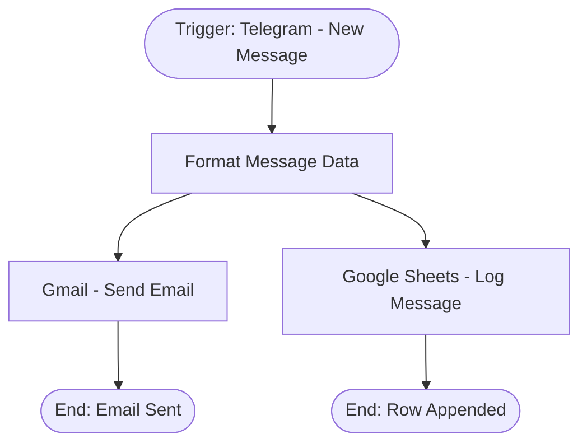

# context.md — Notifications - Telegram Message - Email & Google Sheets

## Purpose
Eliminates the manual effort of forwarding Telegram messages to email and logging them to a spreadsheet. Every incoming Telegram message is automatically forwarded to Vishal's Gmail and appended as a new row in a Google Sheet.

## What It Does
1. Listens for any new message received on the connected Telegram bot
2. Extracts and formats key fields: sender name, username, sender ID, message text, chat ID, timestamp, and message ID
3. Simultaneously sends a formatted HTML email to vishalm@devsavant.com via Gmail
4. Appends a new row to the configured Google Sheet tab with all message fields

## Workflow Diagram

> Diagram auto-generated from workflow node graph at submission time.

## Tools & Connectors Used
| Tool / Service | How It's Used |
|---|---|
| Telegram | Source trigger — fires on every incoming bot message |
| Gmail | Sends a formatted HTML email with full message details to vishalm@devsavant.com |
| Google Sheets | Appends a log row with all message fields to the Telegram Messages tab |

## Credentials Required
| Credential Name | Service | Notes |
|---|---|---|
| Telegram API | Telegram | Bot token from @BotFather — must have message read access |
| Gmail OAuth2 | Gmail | OAuth2 — requires gmail.send scope |
| Google Sheets OAuth2 | Google Sheets | OAuth2 — requires spreadsheets read/write scope |
> ⚠️ Never include credential values — names only.

## KPI Baseline
| Metric | Value |
|---|---|
| Manual time per run (before) | 5 minutes |
| Estimated runs per week | 5 |
| Projected hours saved/week | 0.42 hours (~25 minutes) |

## Risk Self-Assessment
| Risk Type | Present? | Notes |
|---|---|---|
| Handles PII / personal data | Yes | Telegram message content and sender info are processed |
| Makes external API calls | Yes | Telegram, Gmail, Google Sheets APIs |
| Involves financial data | No | — |
| Requires human decision point | No | Fully automated |

## Submitter
**Name:** Vishal Mishra
**Email:** vishalm@devsavant.com
**Date:** 2026-05-27
**n8n Workflow ID:** mT2nuqc40wefhAMQ
**Registry ID:** 44dd4daa-f887-4afc-93fb-833c0cfd1700
**Instance:** vishalmishra.app.n8n.cloud
