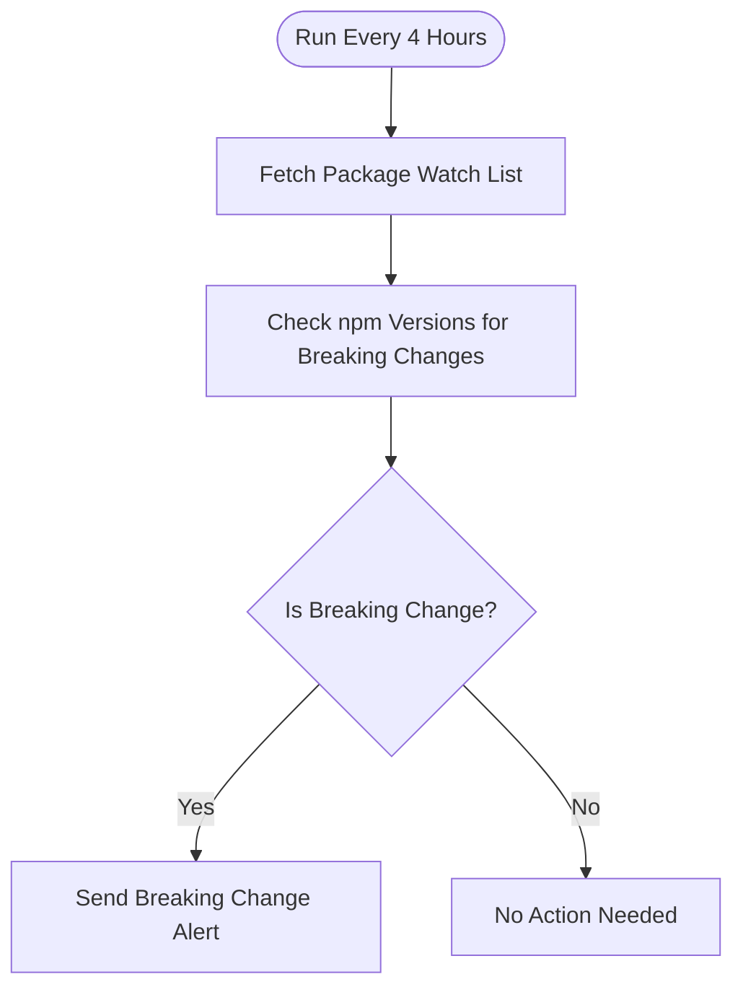

# context.md — Package Updates - Track npm - Breaking Change Alerts

## Purpose
This automation helps developers stay ahead of dependency risk by automatically monitoring a defined list of npm packages and alerting the team by email whenever a major version bump — the standard signal for a breaking change — is detected.

## What It Does
1. **Triggers every 4 hours** on a schedule, running continuously without manual intervention
2. **Reads the package watch list** from `config/watch-packages.json` in the `acme-org/frontend-app` GitHub repository using a Personal Access Token
3. **Queries the npm registry** for each package, fetching the latest published version and the most recent stable prior version
4. **Detects breaking changes** by comparing major version numbers — a jump from v2.x to v3.x is flagged as a breaking change
5. **Checks each package** independently, capturing any fetch errors gracefully without stopping the run
6. **Routes results** through a conditional check — packages with a major version bump proceed to the alert path; others are silently logged and skipped
7. **Sends an HTML alert email** to `dev-team@fulcrumapp.com` for each breaking change, including package name, old and new version, and a direct npm link
8. **Logs a no-op result** for runs where no breaking changes are found

## Workflow Diagram

> Diagram derived from workflow node graph at submission time.

## Tools & Connectors Used
| Tool / Service | How It's Used |
|---|---|
| npm Registry | Queried via public API (`registry.npmjs.org`) for each watched package to retrieve version history and latest release |
| GitHub | The package watch list (`config/watch-packages.json`) is fetched from `acme-org/frontend-app` using the raw content API, authenticated with a Personal Access Token |
| Email (SMTP) | Sends an HTML-formatted breaking change alert to `dev-team@fulcrumapp.com` for each package where a major version bump is detected |

## Credentials Required
| Credential Name | Service | Notes |
|---|---|---|
| GitHub Personal Access Token | GitHub | Read-only access to `acme-org/frontend-app` — used to fetch the package config file |
| SMTP Account | Email | Used to send breaking change alert emails from `automation@fulcrumapp.com` |

> ⚠️ Never include credential values — names only.

## KPI Baseline
| Metric | Value |
|---|---|
| Manual time per run (before) | 10 minutes |
| Estimated runs per week | 7 |
| Projected hours saved/week | 1.17 hours |

## Risk Self-Assessment
| Risk Type | Present? | Notes |
|---|---|---|
| Handles PII / personal data | No | Only package names and version strings are processed |
| Makes external API calls | Yes | Calls the public npm registry API and the GitHub raw content API on every run |
| Involves financial data | No | No financial data is touched |
| Requires human decision point | No | Fully automated — detection and alert happen without human input |
| Could affect shared automations if modified | No | Reads from a config file; no shared automation state is written |

## Submitter
**Name:** user
**Email:** user@fulcrumapp.com
**Date:** 2026-06-08
**n8n Workflow ID:** 6HU6jXVksRbpre6Z
**Registry ID:** 39d89df6-48b3-41d2-b102-8672f0824a2c
**COE Portal:** https://coe-portal.devsavant.com/catalog/39d89df6-48b3-41d2-b102-8672f0824a2c
**Instance:** shivamheaptrace.app.n8n.cloud
**Source:** Original