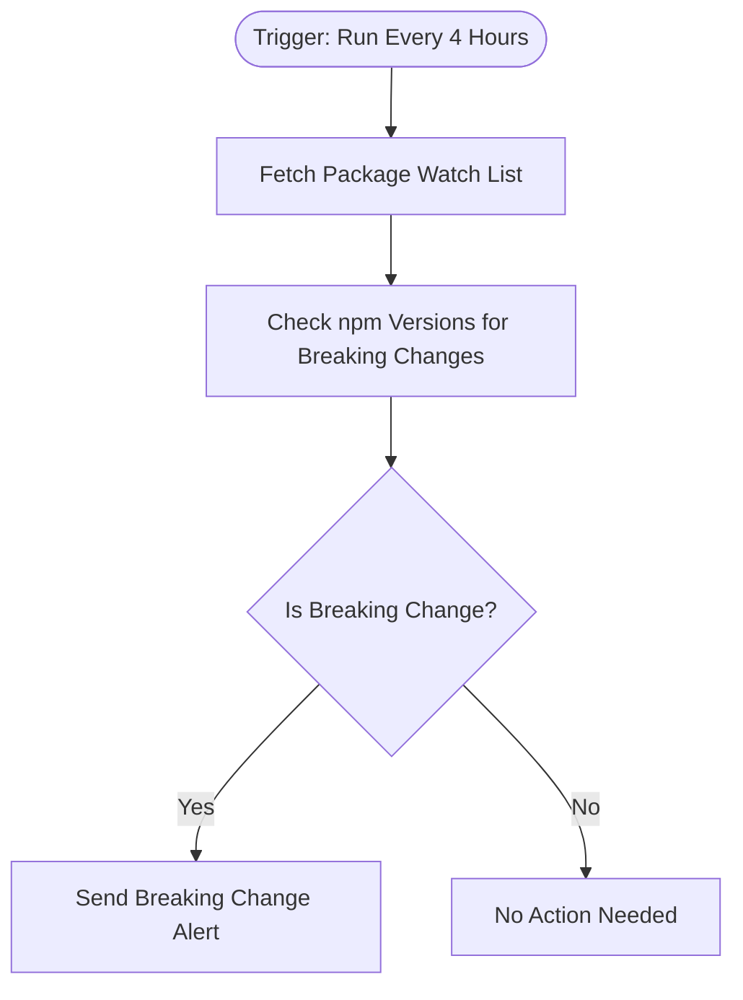

# context.md — Package Updates - Track npm - Breaking Change Alerts

## Purpose
Automatically monitors a defined list of npm packages every 4 hours and notifies the development team by email whenever a major-version (breaking) change is detected, eliminating the need for developers to manually check npm for risky updates.

## What It Does
1. **Triggers on a schedule** — runs automatically every 4 hours around the clock.
2. **Fetches the package watch list** — reads `config/watch-packages.json` from the `acme-org/frontend-app` GitHub repository using a personal access token. The file is a JSON array of package names (e.g. `["react", "express", "lodash"]`).
3. **Checks each package on npm** — queries the public npm registry for the latest published version and the previous stable version of every package in the list.
4. **Detects breaking changes** — compares major version numbers. A jump in the major version (e.g. v3 → v4) is flagged as a breaking change.
5. **Sends an alert email** — for each breaking change found, sends an HTML email to `dev-team@fulcrumapp.com` with the package name, old and new versions, and a direct link to the npm page.
6. **Silently completes** — if no breaking changes are detected, records a no-action status and exits without sending any email.

## Workflow Diagram

> Diagram derived from workflow node graph at submission time.

## Tools & Connectors Used
| Tool / Service | How It's Used |
|---|---|
| npm Registry | Public API queried per package to retrieve version history and latest release tag |
| GitHub | Raw file endpoint used to fetch `config/watch-packages.json` — the list of packages to monitor |
| Email (SMTP) | Sends the formatted HTML breaking-change alert to `dev-team@fulcrumapp.com` |

## Credentials Required
| Credential Name | Service | Notes |
|---|---|---|
| GitHub Personal Access Token | GitHub | Bearer token with `repo:read` scope to fetch the config file from the private repo |
| SMTP Account | Email | SMTP connection used to send the alert email |

> ⚠️ Never include credential values — names only.

## KPI Baseline
| Metric | Value |
|---|---|
| Manual time per run (before) | 10 minutes |
| Estimated runs per week | 7 |
| Projected hours saved/week | 1.2 hours |

## Risk Self-Assessment
| Risk Type | Present? | Notes |
|---|---|---|
| Handles PII / personal data | No | Only package names and version numbers are processed |
| Makes external API calls | Yes | Calls the public npm registry API and GitHub raw content endpoint |
| Involves financial data | No | No financial data involved |
| Requires human decision point | No | Alert is informational only; no automated action is taken |
| Shared automation modification risk | No | Uses personal credentials; read-only access to GitHub and npm |

## Submitter
**Name:** user
**Email:** user@fulcrumapp.com
**Date:** 2026-06-08
**n8n Workflow ID:** 6HU6jXVksRbpre6Z
**Registry ID:** 39d89df6-48b3-41d2-b102-8672f0824a2c
**COE Portal:** https://coe-portal.devsavant.com/catalog/39d89df6-48b3-41d2-b102-8672f0824a2c
**Instance:** shivamheaptrace.app.n8n.cloud
**Source:** Original