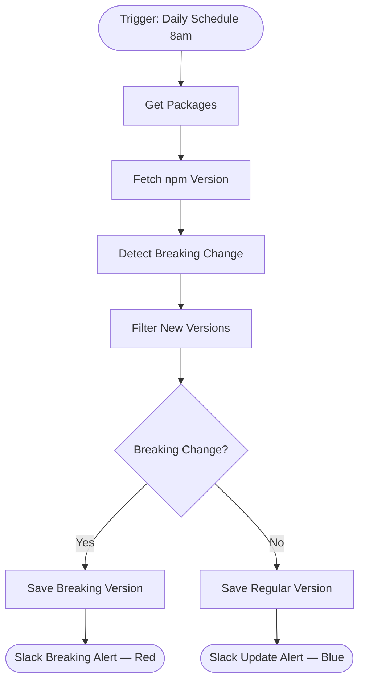

# context.md — Package Updates - Track npm - Slack

## Purpose
Automatically monitors a watchlist of npm packages for new versions, detects major-version (breaking) changes by comparing semver major numbers, and sends colour-coded Slack alerts to the engineering channel so developers can act before a breaking change reaches production.

## What It Does
1. Runs every day at 8am on a schedule trigger
2. Reads all watched packages (name + currently tracked version) from an internal data table called `npm_packages`
3. For each package, fetches the latest published version from the public npm registry API
4. Compares the latest major version number against the tracked major version number
5. Filters out packages with no change — only packages with a new version proceed
6. Routes each update: breaking changes (major bump) go down the red alert path; minor/patch updates go down the blue informational path
7. Updates the tracked version in the data table so repeat alerts are suppressed
8. Posts a colour-coded Slack message to `#engineering-alerts` — red with a changelog link for breaking changes, blue for regular updates

## Workflow Diagram

> Diagram auto-generated from workflow node graph at submission time.

## Tools & Connectors Used
| Tool / Service | How It's Used |
|---|---|
| npm Registry (public API) | Fetches latest version metadata for each watched package via `registry.npmjs.org/<pkg>/latest` |
| Internal Data Table (`npm_packages`) | Stores the watchlist of package names and their last-known tracked versions; updated after each run |
| Slack | Sends colour-coded alerts to `#engineering-alerts` — red for breaking changes, blue for regular updates |

## Credentials Required
| Credential Name | Service | Notes |
|---|---|---|
| Slack OAuth2 | Slack | Requires `chat:write` and `channels:read` scopes |

> ⚠️ Never include credential values — names only.

## KPI Baseline
| Metric | Value |
|---|---|
| Manual time per run (before) | 10 minutes |
| Estimated runs per week | 35 |
| Projected hours saved/week | 5.8 hours |

## Risk Self-Assessment
| Risk Type | Present? | Notes |
|---|---|---|
| Handles PII / personal data | No | Only package names and version strings |
| Makes external API calls | Yes | Public npm registry — no auth required, rate limits unlikely at this scale |
| Involves financial data | No | — |
| Requires human decision point | No | Alerts are informational; developers decide whether to act |
| Modifies an existing shared automation | No | Original build |

## Submitter
**Name:** user
**Email:** user@fulcrumapp.com
**Date:** 2026-06-04
**n8n Workflow ID:** 9846PPf3SWloZW27
**Registry ID:** 796b7c80-5fb1-4a36-ad33-d4a282c6f8c6
**COE Portal:** https://coe-portal.ai.fulcrum.tools/catalog/796b7c80-5fb1-4a36-ad33-d4a282c6f8c6
**Instance:** vishalmishra.app.n8n.cloud
**Source:** Original