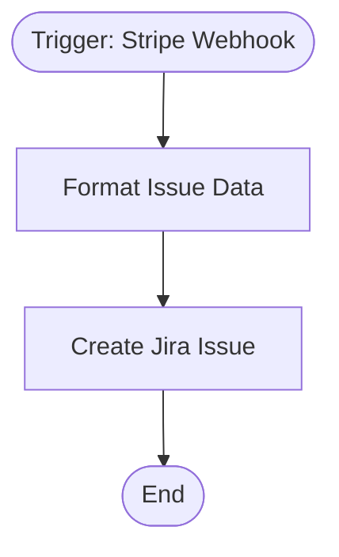

# context.md — Payments - Create Jira Ticket - On Stripe Failure

## Purpose
When a Stripe payment fails, engineers currently have to spot the failure in the Stripe dashboard and manually create a Jira ticket. This workflow eliminates that manual step by listening to Stripe webhooks and automatically opening a Bug ticket in Jira the moment a failure occurs.

## What It Does
1. **Stripe webhook trigger** — listens for three failure event types: `payment_intent.payment_failed`, `charge.failed`, `invoice.payment_failed`
2. **Format Issue Data** — builds a structured Jira summary and description from the Stripe event payload: event type, object ID, amount (converted from cents), currency, customer ID, failure reason (from `last_payment_error.message` or `failure_message`), and Stripe event ID
3. **Create Jira Issue** — creates a Bug in the configured Jira project with labels `stripe`, `payment-failure`, `automated`

## Workflow Diagram

> Diagram auto-generated from workflow node graph at submission time.

## Tools & Connectors Used
| Tool / Service | How It's Used |
|---|---|
| Stripe | Source — webhook events for payment failures |
| Jira | Destination — creates a Bug ticket per failure event |

## Credentials Required
| Credential Name | Service | Notes |
|---|---|---|
| Stripe API | Stripe | Required to register the webhook endpoint |
| Jira Cloud API | Jira | Must have `issues.write` scope; cloud variant |

> ⚠️ Never include credential values — names only.

## KPI Baseline
| Metric | Value |
|---|---|
| Manual time per run (before) | 5 minutes |
| Estimated runs per week | 10 |
| Projected hours saved/week | ~0.83 hours |

## Risk Self-Assessment
| Risk Type | Present? | Notes |
|---|---|---|
| Handles PII / personal data | Yes | Customer ID (`cus_xxx`) is included in Jira description — no PII beyond identifier |
| Makes external API calls | Yes | Stripe (inbound webhook), Jira (write) |
| Involves financial data | Yes | Payment amounts included in ticket description for context |
| Requires human decision point | No | Fully automated; engineer acts on the Jira ticket |

## Submitter
**Name:** Vishal Mishra
**Email:** vishalm@devsavant.com
**Date:** 2026-06-03
**n8n Workflow ID:** cVpYw0iPd2fb9cjH
**Registry ID:** 905a3326-eb03-4327-919c-972bc31ec22e
**COE Portal:** http://localhost:3000/catalog/905a3326-eb03-4327-919c-972bc31ec22e
**Instance:** shivamheaptrace.app.n8n.cloud