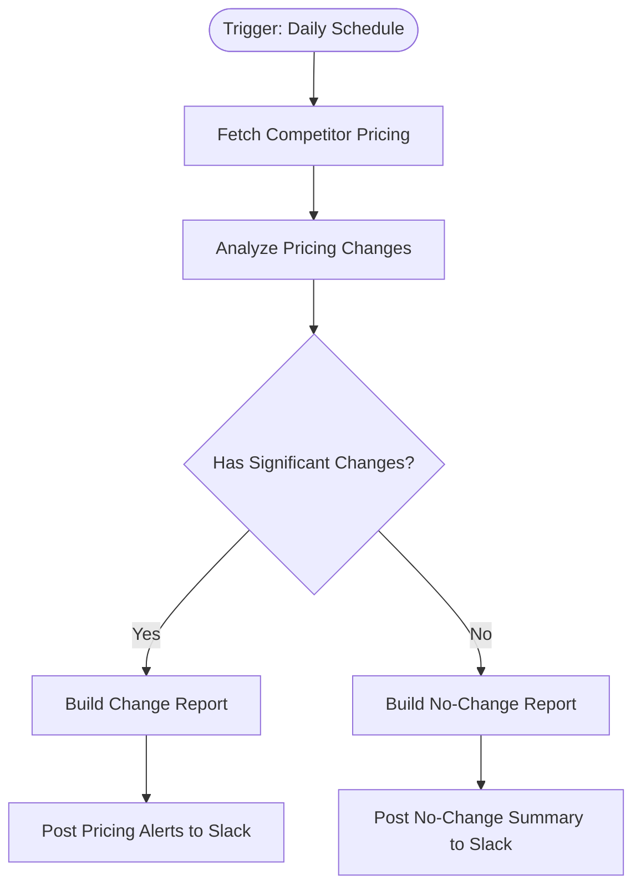

# context.md — Pricing - Monitor Competitors - Slack

## Purpose
This workflow automates daily competitor pricing surveillance for the Engineering team, eliminating the need to manually check and compare product prices each day. It surfaces meaningful price movements automatically so the team can react quickly without manual effort.

## What It Does
1. Fires automatically every morning at 8:00 AM via a daily schedule trigger
2. Fetches the latest product pricing data from the Fake Store public API
3. Analyzes each product's price against a simulated previous price, computing the percentage change
4. Identifies products with significant price movements (greater than 5% change)
5. Routes to the appropriate report path: a detailed movers report if changes exist, or a quiet "all clear" message if nothing significant changed
6. Builds a formatted Slack message summarising the top price movers (up to 5) with direction indicators
7. Posts the daily report to the #pricing-alerts Slack channel

## Workflow Diagram

> Diagram derived from workflow node graph at submission time.

## Tools & Connectors Used
| Tool / Service | How It's Used |
|---|---|
| Fake Store API | Public demo REST API — fetches a list of products with current pricing data each run |
| Slack | Receives the formatted daily pricing report in the #pricing-alerts channel |

## Credentials Required
| Credential Name | Service | Notes |
|---|---|---|
| Slack OAuth2 | Slack | Required to post messages to the #pricing-alerts channel |

> ⚠️ Never include credential values — names only.

## KPI Baseline
| Metric | Value |
|---|---|
| Manual time per run (before) | 10 minutes |
| Estimated runs per week | 7 |
| Projected hours saved/week | 1.2 hours |

## Risk Self-Assessment
| Risk Type | Present? | Notes |
|---|---|---|
| Handles PII / personal data | No | Only public product pricing data is processed |
| Makes external API calls | Yes | Calls Fake Store API (public, no auth) and Slack API (OAuth2) |
| Involves financial data | No | Pricing data is public competitive intelligence, not internal financial records |
| Requires human decision point | No | Fully automated — no manual approval step in the flow |
| Shared automation modification risk | No | Original build; no existing shared automation was modified |

## Submitter
**Name:** Vishal Mishra
**Email:** vishalm.mishra@fulcrumapp.com
**Date:** 2026-06-09
**n8n Workflow ID:** 94uoAfCwuAynfWdW
**Registry ID:** 47c2d45f-eb05-4021-9ef5-25da8a99843f
**COE Portal:** https://coe-portal.devsavant.com/catalog/47c2d45f-eb05-4021-9ef5-25da8a99843f
**Instance:** shivamheaptrace.app.n8n.cloud
**Source:** Original