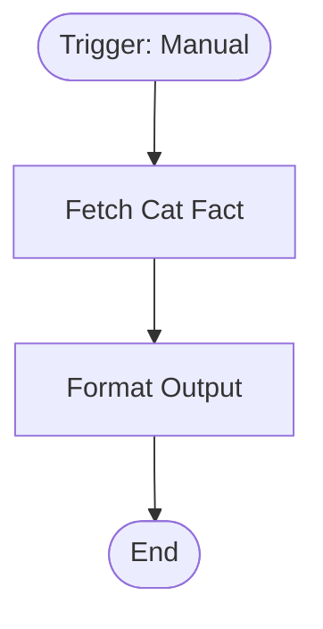

# context.md — Sample - Cat Fact - Fetch and Format

## Purpose
Demonstrates a clean trigger → external HTTP fetch → structured field mapping pattern using a public, credential-free API. Used as a reference workflow for onboarding team members to the devsavant n8n automation stack.

## What It Does
1. A team member manually triggers the workflow from the n8n UI or via MCP.
2. An HTTP GET request is made to `https://catfact.ninja/fact`, a public API that returns a random cat fact as JSON (`{ fact: string, length: number }`).
3. The Format Output node maps the raw response into five consistently named fields: `fact`, `char_count`, `fetched_at` (ISO 8601 timestamp), `source`, and `is_long_fact` (boolean flag — true when the fact exceeds 80 characters).

## Workflow Diagram

> Diagram derived from workflow node graph at submission time.

## Tools & Connectors Used
| Tool / Service | How It's Used |
|---|---|
| catfact.ninja | Public REST API — returns a random cat fact on each GET request |
| n8n HTTP Request node | Issues the GET call to the cat fact API |
| n8n Edit Fields (Set) node | Renames and enriches the response fields into structured output |

## Credentials Required
_None — this workflow calls a fully public, unauthenticated API._

## KPI Baseline
| Metric | Value |
|---|---|
| Manual time per run (before) | N/A (sample/demo workflow) |
| Estimated runs per month | N/A |
| Projected hours saved/month | N/A |

## Risk Self-Assessment
| Risk Type | Present? | Notes |
|---|---|---|
| Handles PII / personal data | No | Public cat facts only |
| Makes external API calls | Yes | GET to `catfact.ninja` — public, read-only, no rate limits for low volume |
| Involves financial data | No | |
| Requires human decision point | No | Fully automated |

## Submitter
**Name:** Vishal Mishra
**Date:** 2026-05-26
**n8n Workflow ID:** gaYrMAfKW8lD51o9
**Instance:** vishalmishra.app.n8n.cloud
