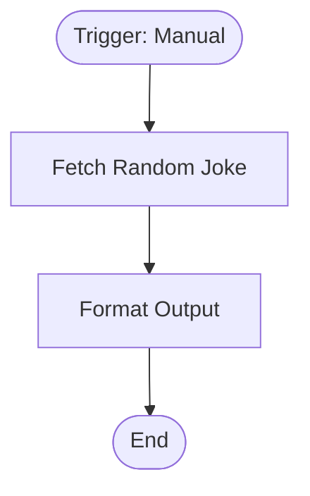

# context.md — Sample - Fetch Daily Joke - Format Output

## Purpose
Demonstrates a minimal end-to-end n8n workflow pattern: trigger → external HTTP fetch → field formatting. Used as a reference/sample for onboarding new team members to the devsavant automation stack.

## What It Does
1. A team member manually triggers the workflow from the n8n UI or via MCP.
2. The workflow sends a GET request to the public Official Joke API (`https://official-joke-api.appspot.com/random_joke`), which returns a random joke as JSON.
3. The Edit Fields node maps the raw API response into a clean, consistently named output: `joke_id`, `category`, `setup`, `punchline`, `fetched_at` (ISO timestamp), and `summary` (setup + punchline concatenated).

## Workflow Diagram

> Diagram derived from workflow node graph at submission time.  
> Each box represents an n8n node in execution order.

## Tools & Connectors Used
| Tool / Service | How It's Used |
|---|---|
| Official Joke API | Source of random joke data (public, no auth required) |
| n8n HTTP Request node | Makes the GET call to the joke API |
| n8n Edit Fields (Set) node | Maps and renames API response fields into clean output |

## Credentials Required
_None — this workflow uses a public API with no authentication._

## KPI Baseline
| Metric | Value |
|---|---|
| Manual time per run (before) | ~2 minutes (copy/paste from API manually) |
| Estimated runs per month | N/A (sample/demo workflow) |
| Projected hours saved/month | N/A |

## Risk Self-Assessment
| Risk Type | Present? | Notes |
|---|---|---|
| Handles PII / personal data | No | Public joke data only |
| Makes external API calls | Yes | GET to `official-joke-api.appspot.com` — public, read-only |
| Involves financial data | No | |
| Requires human decision point | No | Fully automated |

## Submitter
**Name:** Vishal Mishra  
**Date:** 2026-05-21  
**n8n Workflow ID:** cXBOQCYvOSK0b77n  
**Instance:** vishalmishra.app.n8n.cloud
