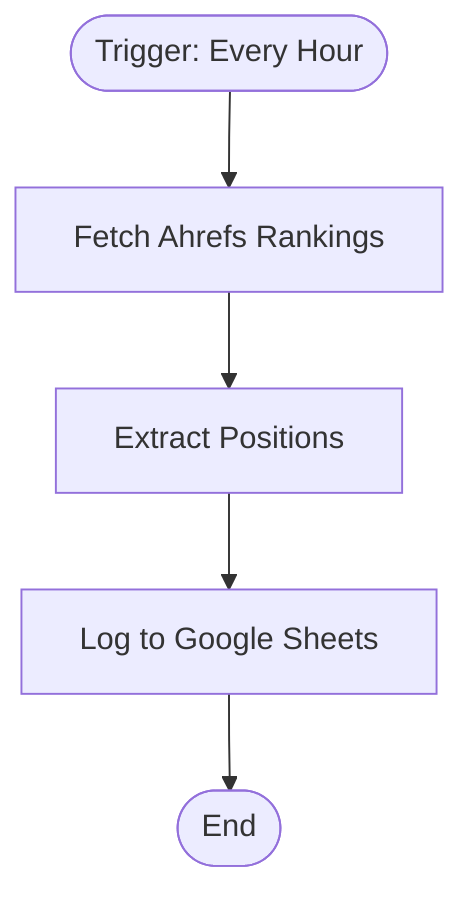

# context.md — SEO - Track Rankings - Google Sheets

## Purpose
Automatically tracks keyword SEO rankings from Ahrefs on an hourly schedule and logs every change into a Google Sheet, eliminating the need for manual rank checking.

## What It Does
1. Fires every hour via a schedule trigger
2. Calls the Ahrefs API to fetch the top 100 keyword positions for the configured domain
3. Extracts each keyword's current position, previous position, position change, ranking URL, and search volume
4. Appends a timestamped row per keyword into the designated Google Sheet

## Workflow Diagram

> Diagram auto-generated from workflow node graph at submission time.

## Tools & Connectors Used
| Tool / Service | How It's Used |
|---|---|
| Ahrefs | Fetches top 100 keyword positions via the Site Explorer API |
| Google Sheets | Appends a new row per keyword with ranking data each run |

## Credentials Required
| Credential Name | Service | Notes |
|---|---|---|
| Ahrefs API Token | Ahrefs | Bearer token for Site Explorer API access |
| Google Sheets | Google Sheets | OAuth2 — personal Google account |
> ⚠️ Never include credential values — names only.

## KPI Baseline
| Metric | Value |
|---|---|
| Manual time per run (before) | 10 minutes |
| Estimated runs per week | 7 |
| Projected hours saved/week | 1.2 hours |

## Risk Self-Assessment
| Risk Type | Present? | Notes |
|---|---|---|
| Handles PII / personal data | No | Only SEO ranking data |
| Makes external API calls | Yes | Ahrefs Site Explorer API |
| Involves financial data | No | — |
| Requires human decision point | No | Fully automated |
| Modifies an existing shared automation | No | Original build |

## Submitter
**Name:** user
**Email:** user@fulcrumapp.com
**Date:** 2026-06-04
**n8n Workflow ID:** tNai6vEO8VW4b421
**Registry ID:** 3e482543-99de-451a-a2e0-c43b8553783b
**COE Portal:** https://coe-portal.ai.fulcrum.tools/catalog/3e482543-99de-451a-a2e0-c43b8553783b
**Instance:** fulcrumtest.app.n8n.cloud
**Source:** Original