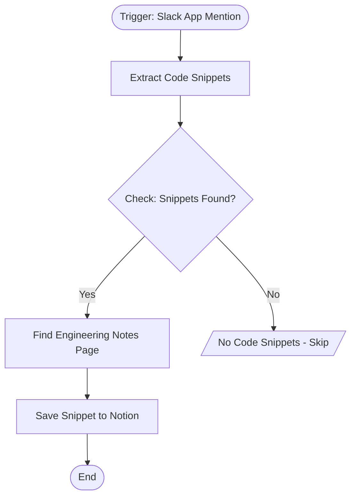

# context.md — Slack - Capture Code Snippets - Notion

## Purpose
Engineers frequently share useful code snippets in Slack but they get buried and lost over time. This workflow automatically captures those snippets and saves them — along with their message context — to a central engineering notes page in Notion, so nothing valuable gets lost.

## What It Does
1. **Listens for app mentions** — The Slack bot watches the entire workspace for any message that mentions it.
2. **Extracts code blocks** — A custom script scans the message for triple-backtick fenced code blocks (with or without a language hint) and extracts each one.
3. **Checks if any snippets were found** — If the message had no code blocks, the workflow silently stops. No noise.
4. **Finds the engineering notes page** — Searches Notion for the page titled "Engineering Notes" to get its ID.
5. **Saves each snippet to Notion** — Appends a heading with timestamp, the surrounding message context, and the code itself (formatted as inline code) to the engineering notes page.

## Workflow Diagram

> Diagram derived from workflow node graph at submission time.

## Tools & Connectors Used
| Tool / Service | How It's Used |
|---|---|
| Slack | Listens for app mention events across the entire workspace to detect messages containing code blocks |
| Notion | Searched for the engineering notes page by name; code snippets and context are appended as new blocks |

## Credentials Required
| Credential Name | Service | Notes |
|---|---|---|
| Slack API | Slack | Bot token with `app_mentions:read` scope to receive mention events |
| Notion API | Notion | API key with read access to pages and write access to blocks |

> ⚠️ Never include credential values — names only.

## KPI Baseline
| Metric | Value |
|---|---|
| Manual time per run (before) | 4 minutes |
| Estimated runs per week | 7 |
| Projected hours saved/week | 0.47 hours |

## Risk Self-Assessment
| Risk Type | Present? | Notes |
|---|---|---|
| Handles PII / personal data | No | Only processes code blocks and message text shared in Slack by the user |
| Makes external API calls | Yes | Calls Slack API (event trigger) and Notion API (page search + block append) |
| Involves financial data | No | Engineering code snippets only — no financial data |
| Requires human decision point | No | Fully automated — no human approval step needed |
| Shared automation modification risk | No | Original build — not a modification of an existing shared automation |

## Submitter
**Name:** Vishal Mishra
**Email:** vishalm.mishra@fulcrumapp.com
**Date:** 2026-06-12
**n8n Workflow ID:** tUugOMjh5ft1vGjx
**Registry ID:** fa068515-c4ea-4c26-a3e5-2f68fc735ea3
**COE Portal:** https://coe-portal.devsavant.com/catalog/fa068515-c4ea-4c26-a3e5-2f68fc735ea3
**Instance:** shivamheaptrace.app.n8n.cloud
**Source:** Original