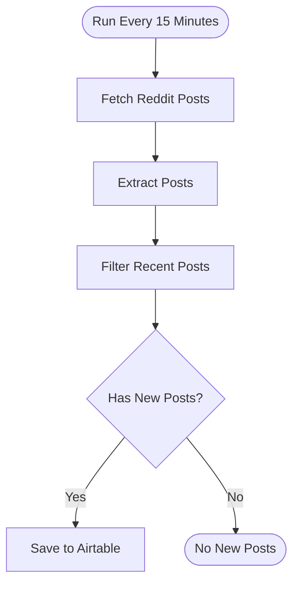

# context.md — Social - Monitor Reddit AI Agents - Airtable

## Purpose
Eliminates the manual effort of checking Reddit for mentions of "AI agents" by automatically searching all of Reddit every 15 minutes and logging new matching posts into Airtable for the Engineering team to review.

## What It Does
1. Triggers on a schedule every 15 minutes
2. Calls the Reddit public search API with the keyword "AI agents", sorted by newest, limited to the past hour
3. Parses the response and extracts key fields: post ID, title, author, subreddit, URL, score, comment count, post time, and a text snippet
4. Filters posts to only those created in the last 15 minutes to avoid storing duplicates across runs
5. Checks whether any new posts were found — if yes, saves each one as a new record in Airtable; if no, exits cleanly with no action

## Workflow Diagram

> Diagram auto-generated from workflow node graph at submission time.

## Tools & Connectors Used
| Tool / Service | How It's Used |
|---|---|
| Reddit | Public search API (`/search.json`) queried every 15 minutes for posts matching "AI agents", sorted by new |
| Airtable | Receives one new record per matching Reddit post with all key fields |

## Credentials Required
| Credential Name | Service | Notes |
|---|---|---|
| Airtable API Token | Airtable | Used to write new records to the target base and table |
> ⚠️ Never include credential values — names only.

## KPI Baseline
| Metric | Value |
|---|---|
| Manual time per run (before) | 4 minutes |
| Estimated runs per week | 7 |
| Projected hours saved/week | 0.47 hours |

## Risk Self-Assessment
| Risk Type | Present? | Notes |
|---|---|---|
| Handles PII / personal data | No | Only stores public Reddit post metadata |
| Makes external API calls | Yes | Calls Reddit public search API and Airtable API on every run |
| Involves financial data | No | No financial data involved |
| Requires human decision point | No | Fully automated — no human approval step |
| Shared automation modification risk | No | Original build; no shared automation modified |

## Submitter
**Name:** Vishal Mishra
**Email:** vishalm.mishra@fulcrumapp.com
**Date:** 2026-06-11
**n8n Workflow ID:** AxgpIKrjQC7hv2cX
**Registry ID:** 9b06038e-8a8a-4b3e-8fd7-bef57ef371f3
**COE Portal:** https://coe-portal.devsavant.com/catalog/9b06038e-8a8a-4b3e-8fd7-bef57ef371f3
**Instance:** shivamheaptrace.app.n8n.cloud
**Source:** Original